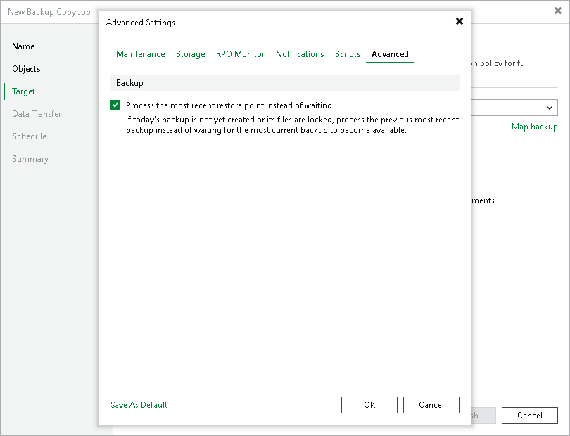

# Advanced

In this article

If a new restore point is not yet created, you can process the most recent restore point instead of waiting. To do so, select the Process the most recent restore point instead of waiting check box.

|  |
| --- |
| Note |
| This option is available only in the periodic backup copy job. |

Page updated 8/31/2025

Page content applies to build 13.0.1.1071
