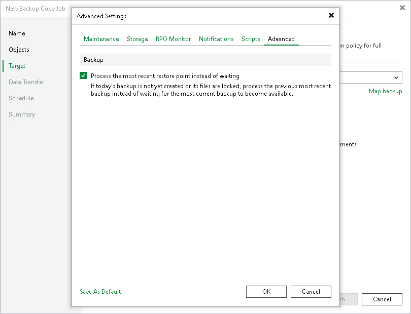

# Advanced

To specify advanced settings for the backup copy job:

1. At the Target step of the wizard, click Advanced job settings.
2. Click the Advanced tab.
3. Select the Process the most recent restore point instead of waiting option to process the most recent restore point instead of waiting when a new restore point is not yet created.
4. If you want to save this set of settings as the default one, click Save as Default. When you create a new job, the saved settings will be offered as the default. This also applies to all users added to the backup server.

|  |
| --- |
| Note |
| This option is available only in the periodic backup copy job. |

Page updated 2026-07-27

