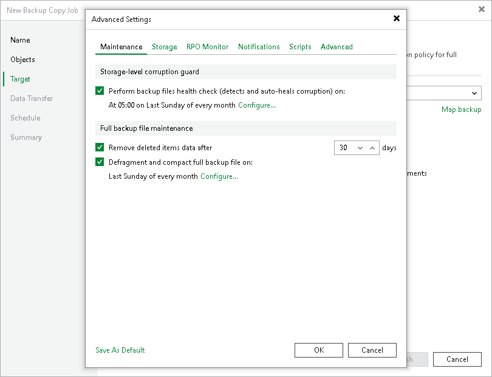

# Maintenance Settings

In this article

To specify settings for backup files stored in the target backup repository:

1. At the Target step of the wizard, click Advanced.
2. If you want to periodically perform a health check of the most recent restore point in the backup chain, select the Perform backup files health check check box. To specify the schedule for the health check, click Configure.

By default, the health check is scheduled to start at 5:00 on last Sunday of every month. For more information on the health check, see [Health Check for Backup Files](backup_copy_health_check.md).

1. Select the Remove deleted items data after check box and specify the retention policy settings for deleted workloads.

By default, the deleted item retention period is 30 days. It is recommended that you set the retention period to 3 days or more to prevent unwanted data loss. For more information on the retention policy and its limitations, see [Deleted Items Retention](backup_copy_deleted_vms.md).

1. To periodically compact a full backup, select the Defragment and compact full backup file check box. To specify the schedule for the compacting operation, click Configure.

By default, the compact operation is disabled. For more information on compact of full backup files, see [Compact of Full Backup File](backup_copy_compact_file.md).

1. If you want to save this set of settings as the default one, click Save as default. When you create a new job, the saved settings will be offered as the default. This also applies to all users added to the backup server.

|  |
| --- |
| Important |
| When enabling the Defragment and compact full backup file option, consider the following:   * The Defragment and compact full backup file option can be enabled only if GFS retention policy is disabled. * The target backup repository must have enough space to store a file of the full backup size. During the compact process, Veeam Backup & Replication creates an auxiliary VBK file that exists in the backup repository until the end of the compact operation. * [For the legacy periodic backup copy job] If you do not want to copy data for workloads that have only one restore point in the full backup file and this restore point is older than 7 days, check that the following conditions are met: Remove deleted items data is disabled; Use per-machine backup files is disabled in the settings of the target backup repository.   Veeam Backup & Replication will extract data for such workloads from the full backup file and write this data to a separate backup file. The file will be displayed under the Backups > Disk (Imported) node in the Home view. |

Page updated 8/2/2024

Page content applies to build 13.0.1.1071
