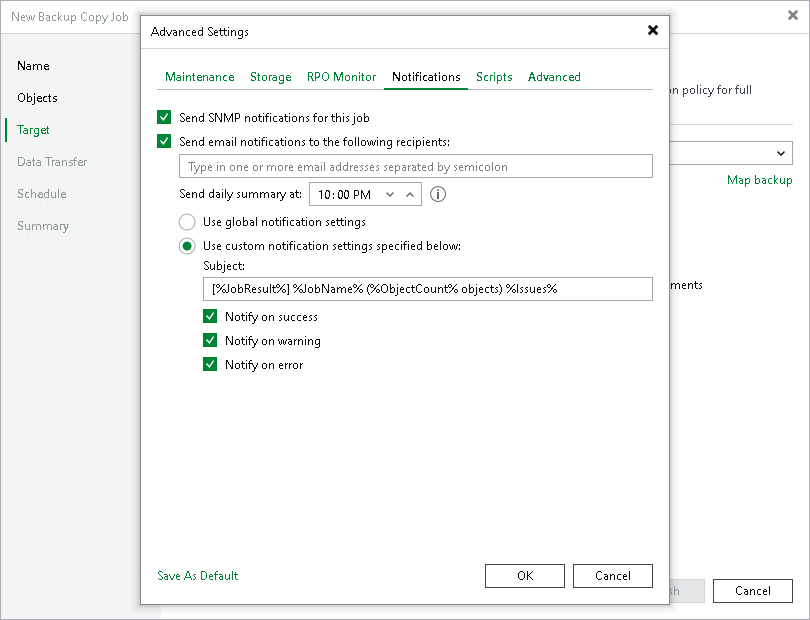

# Notification Settings

To specify notification settings for the backup copy job:

1. At the Target step of the wizard, click Advanced.
2. Click the Notifications tab.
3. Select the Send SNMP notifications for this job check box if you want to receive SNMP traps when the job completes successfully. In the periodic copy mode, you will receive notifications when the entire backup copy job finishes. In the immediate copy mode — when copying of each source backup job finishes.

SNMP traps will be sent if you specify global SNMP settings in Veeam Backup & Replication and configure software on the recipient workload to receive SNMP traps. For more information, see [Specifying SNMP Settings](snmp_settings.md).

1. Select the Send email notifications to the following recipients check box if you want to receive notifications by email in case of job failure or success. In the field under the check box, specify the recipient email address. You can enter several addresses separated by a semicolon.

Veeam Backup & Replication sends notifications when copying of each source backup job finishes. For example, if your backup copy job contains two source backup jobs, you will receive two emails.

Email notifications will be sent if you configure global email notification settings in Veeam Backup & Replication. For more information on how to configure global notification settings, see [Configuring Global Email Notification Settings](general_email_notifications.md).

1. In the Send daily summary at field, specify when you want to send notifications about backup copy jobs that process log backups. Veeam Backup & Replication sends a consolidated report once a day at the specified time.
2. You can choose to use global notification settings or specify custom notification settings.

+ To receive a typical notification for the job, select Use global notification settings. In this case, Veeam Backup & Replication will apply to the job global email notification settings specified for the backup server. For more information, see [Configuring Global Email Notification Settings](general_email_notifications.md).
+ To configure a custom notification for a job, select Use custom notification settings specified below. You can specify the following notification settings:

1. In the Subject field, specify a notification subject. You can use the following variables in the subject: %Time% (completion time), %JobName% (the backup copy job name and source backup job name in the CopyJobName\SourceJobName format), %JobResult%, %ObjectCount% (number of workloads in the job) and %Issues% (number of workloads in the job that have been processed with the Warning or Failed status).
2. Select the Notify on success, Notify on warning and Notify on error check boxes to receive email notification if data processing completes successfully, completes with a warning or fails.

1. [For the immediate copy mode] Select when you want to receive notifications, Immediately after each copied backup option or Daily as a summary.
2. If you want to save this set of settings as the default one, click Save as default. When you create a new job, the saved settings will be offered as the default. This also applies to all users added to the backup server.

