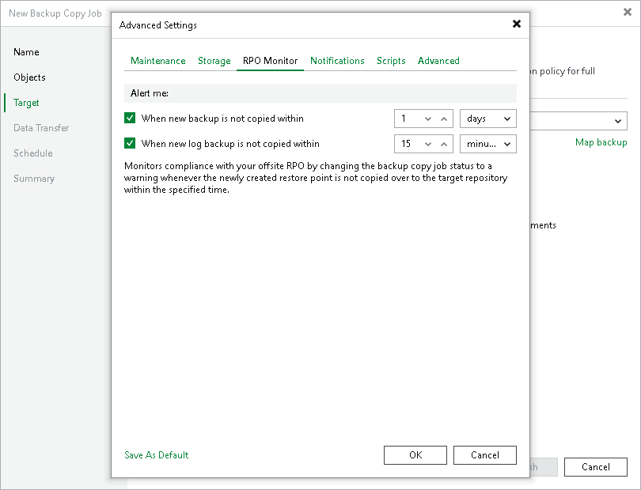

# RPO Monitor Settings

In this article

You can instruct a backup copy job to display a warning if a newly created restore point or transaction log is not copied within the desired recovery point objective (RPO). The RPO is counted down from the moment when the source backup job finishes and is ready to be copied.

To mark a job with the Warning status when the RPO is exceeded, do the following:

1. At the Target step of the wizard, click Advanced.
2. Click the RPO Monitor tab.
3. Select the When new backup is not copied within check box.
4. In the fields on the right, specify the desired RPO in minutes, hours or days. If you specify days, RPO monitor will consider calendar days instead of the 24 hours period.
5. If you have enabled copying of log backups, select the When new log backup is not copied within check box.
6. In the fields on the right, specify the desired RPO in minutes, hours or days.
7. Click Save as default if you want to save this set of RPO settings as the default one. When you create a new job, the saved settings will be offered as the default. This also applies to all users added to the backup server.

Page updated 8/31/2025

Page content applies to build 13.0.1.1071
