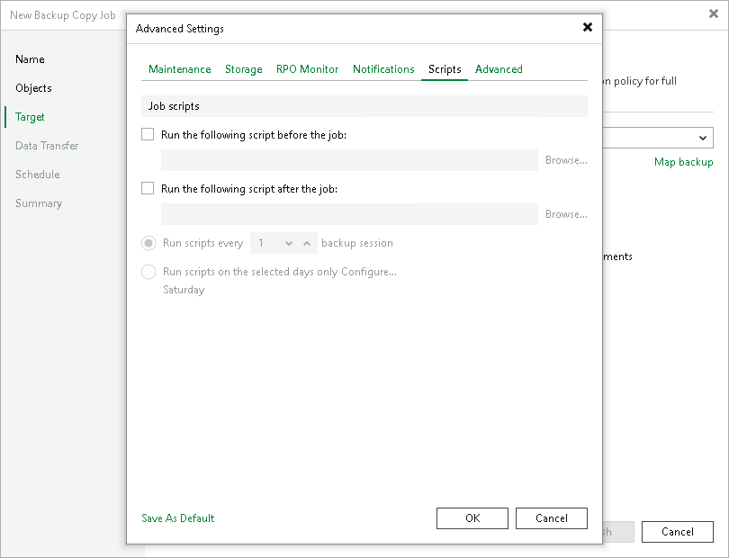

# Scripts Settings

To specify script settings for the backup copy job:

1. At the Target step of the wizard, click Advanced.
2. Click the Scripts tab.
3. Select the Run the following script before the job and Run the following script after the job check boxes to execute custom scripts before and after the backup copy job. Note that in the immediate copy mode, scripts are executed for every source backup job.

Then click Browse and select executable files from a local folder on the backup server. The scripts will be executed on the backup server after the transformation processes are completed on the target repository

1. You can change how often the scripts must be executed:

+ To run the scripts after a specific number of backup copy sessions, select Run scripts every... backup session option and specify the number of sessions.
+ To run the scripts on specific days, select the Run scripts on selected days only option and click the Days button to specify week days.

|  |
| --- |
| Note |
| If you select the Run scripts on the selected days only option, Veeam Backup & Replication executes scripts only once on each selected day — when the job runs for the first time. During subsequent job runs, scripts are not executed. |

