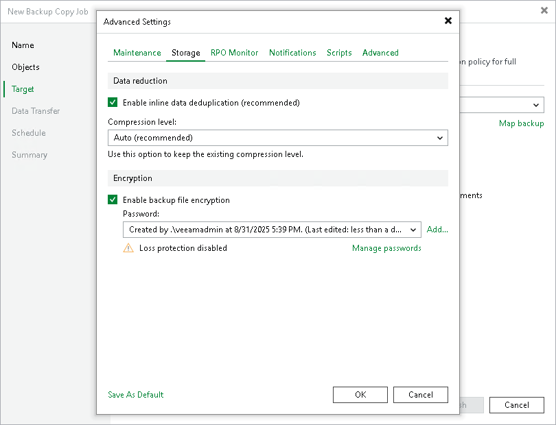

# Storage Settings

In this article

To specify compression, deduplication and encryption settings for backup files stored in the target backup repository, do the following:

1. At the Target step of the wizard, click Advanced.
2. Click the Storage tab.
3. In the Data reduction section, specify data compression and deduplication settings:

* By default, Veeam Backup & Replication performs deduplication before storing copied data in the target backup repository. To disable data deduplication, clear the Enable inline data deduplication check box.

For more information on deduplication, see [Deduplication](compression_deduplication.md#dedup).

* From the Compression level list, select a compression level.

For more information on data compression levels, see [Data Compression](compression_deduplication.md).

1. To encrypt backup files, select the Enable backup file encryption check box. In the Password field, select the encryption method you want to use — a password that will generate secret keys or an external KMS server that will generate KMS keys. For more information about backup copy job encryption, see [Encrypting Backup Copy Jobs](encrypting_backup_copy_jobs.md).

If you have not created the password beforehand, click Add or use the Manage passwords link to specify a new password. For more information, see [Password Manager](password_manager.md).

If you do not use password loss protection, Veeam Backup & Replication will display a warning about it. For more information, see [Password Loss Protection](encryption_password_loss_protection.md).

1. If you want to save this set of settings as the default one, click Save as default. When you create a new job, the saved settings will be offered as the default. This also applies to all users added to the backup server.

Page updated 8/31/2025

Page content applies to build 13.0.1.1071
