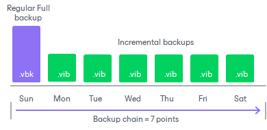
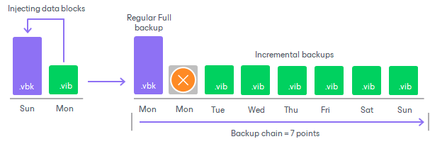

# Short-Term Retention Policy

The short-term retention policy allows retaining restore points created by backup copy jobs for a specified number of days or until the number of restore points reaches the specified number in the retention settings.

During the first backup copy session, Veeam Backup & Replication creates the first restore point — a full backup. The next backup copy sessions add incremental backups to the backup chain. As a result, the regular backup cycle produces a chain of a full backup and set of incremental backups in the target backup repository. When the retention policy is exceeded, Veeam Backup & Replication removes the earliest restore points from backup chains in the target backup repositories.

Since Veeam Backup & Replication [creates forever forward incremental backup chains](backup_copying_process.md) while backup copy jobs run, Veeam Backup & Replication applies the [forever forward incremental retention policy](retention_forever_incremental.md) to remove restore points and maintain the desired number of restore points.

When [configuring short-term retention policy settings](backup_copy_target.md) for a backup copy job, you have two options:

* Specify the number of restore points.

Veeam Backup & Replication keeps the last N restore points, where N is the number of restore points that you specify in the settings. The minimum number that you can specify is 2.

* Specify the number of days.

Veeam Backup & Replication keeps restore points created during the last N days, where N is the number of days that you specify in the settings. The minimum number that you can specify is 2.

Consider the following for the daily retention policy:

* The minimum number of retained restore points is 3. This number does not depend on the number of days set in the retention policy. For example, the retention policy is set to 5 days. You launch the job after it was stopped for 10 days. Normally, Veeam Backup & Replication deletes all previous restore points. However, due to the minimum number of retained restore points, you will still have at least 3 restore points: the newly created restore point and the two previous ones.

You can change the minimum number of retained restore points in the in the configuration file on the Linux-based backup server or with a registry value on the Microsoft Windows-based backup server. For more information, contact [Veeam Customer Support](https://www.veeam.com/support.html).

* If the backup job starts at the end of the day and finishes the next day, Veeam Backup & Replication assumes that the restore point is created at the moment when the backup job started. However, Veeam Backup & Replication starts counting retention policy days only after the backup job finishes processing workloads.
* When determining whether the number of allowed days is exceeded, Veeam Backup & Replication ignores the day when the daily retention policy runs. In fact, Veeam Backup & Replication keeps restore points for the N + 1 days, where N is the number of days that you specify in the settings.
* When determining whether the number of allowed days is exceeded, Veeam Backup & Replication also counts days when the backup job did not create any backups.

|  |
| --- |
| Note |
| If you want to create full backups periodically (weekly, monthly, yearly), enable the [GFS retention policy](backup_copy_gfs.md). If you do not enable the GFS retention, the regular backup copy cycles will create only incremental backups. |

|  |
| --- |
| Important |
| This section describes how the short-term retention policy functions when the GFS retention policy is disabled. If you enable the GFS retention policy, consider the following:   * The backup copy chain will contain more restore points than you have specified in the short-term retention policy. * With enabled GFS retention policy, Veeam Backup & Replication applies the forward-incremental retention policy to the backup copy chain.   For details, see [GFS Retention Policy](backup_copy_gfs.md). |

Example

The regular backup cycle is based on the short-term retention policy scheme. When you specify retention policy settings, you define how many restore points you want to retain in the backup chain in the target backup repository.

For example, you have selected to retain 7 restore points. The backup copy runs once a day and starts on Sunday.

1. Veeam Backup & Replication creates a full backup on Sunday and add 6 incremental backups Monday through Saturday.

1. On Sunday, Veeam Backup & Replication creates another increment. As a result, there will be 8 restore points, which exceeds the retention policy. Thus, the oldest increment is merged to the full backup.

After the oldest increment is merged to the full backup, Veeam Backup & Replication removes the increment as it is no longer needed.

Related Topics

[Long-Term Retention Policy (GFS)](backup_copy_gfs.md)

