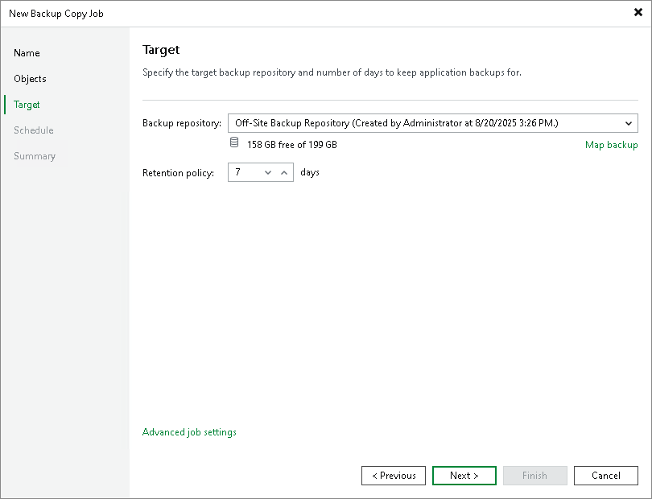

# Step 4. Define Backup Copy Target

In this article

At the Target step of the wizard, configure the target repository settings.

1. From the Backup repository list, select a backup repository in the target site where copied backups must be stored. When you select a target backup repository, Veeam Backup & Replication automatically checks how much free space is available on it. Make sure that you have enough free space to store copied backups.

|  |
| --- |
| Important |
| For Veeam Plug-In backup copy jobs, you cannot select the [Veeam Cloud Connect repository](https://helpcenter.veeam.com/docs/vbr/cloud/cloud_connect_configure_repository.html?ver=13) as a backup copy target. |

1. If the target repository contains a Veeam Plug-In backup that was excluded from the backup copy job, and if you don't want to transfer duplicate data, you can use the mapping feature.

After you configure mapping, if some of backup files (.VAB) of the source backup are missing in the target backup copy, these files are uploaded to the target backup copy.

|  |
| --- |
| Note |
| Veeam Plug-In backup copy jobs do not use WAN accelerators. |

To map a backup copy job to the backup:

1. Click the Map backup link.
2. Point the backup copy job to the backup in the target backup repository. Backups in the target backup repository can be easily identified by backup job names. To facilitate search, you can use the search field at the bottom of the window.

|  |
| --- |
| Important |
| Used account must have access to Veeam backup repositories that you plan to use. Otherwise, the repositories will not be listed as available. To learn how to configure access permissions on repositories, see [Access and Encryption Settings on Repositories](repository_permissions.md). |

1. You can specify the number of days after which the backup copy will be deleted from the repository. Note that the countdown starts from the moment when source backup has been created.

Page updated 12/4/2025

Page content applies to build 13.0.1.1071
