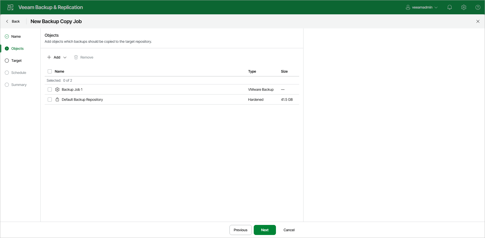

# Step 3. Select Workloads to Process

At the Objects step of the wizard, select workloads whose restore points you want to copy to the target backup repository:

1. Click Add.
2. Select a type of a source from which you want to copy restore points:

* From jobs. You will see existing backup jobs. Veeam Backup & Replication will copy restore points created by the selected jobs.

You can use another backup copy job as a source to process VMware and Hyper-V workloads, including workloads located on backup repositories with rotated drives.

|  |
| --- |
| Note |
| Agent backup jobs are not supported. |

[For the periodic copy mode] If multiple jobs process one workload, Veeam Backup & Replication copies only restore points created by the first job in the Objects to process list.

* From repositories. You will see all backup repositories in the backup infrastructure. Veeam Backup & Replication will copy restore points stored on the selected backup repositories.

If you select repositories as sources, and target new jobs to the repositories in future, Veeam Backup & Replication will update backup copy job settings automatically to include these jobs to be copied.

1. In the Select window, select the necessary workloads. You can search workloads by name using the search field.
2. Click Ok.

As an alternative, you can create a backup copy job with an empty source — that is, do not add any workloads at this step of the wizard. In this case, you need to configure a secondary destination for the source backup job and link it to the created backup copy job. For more information, see [Linking Backup Jobs to Backup Copy Jobs](linking_backup_to_copy.md).

Related Topics

[Restore Point Selection](backup_copy_select_point.md)

