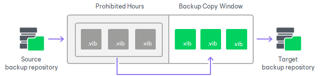
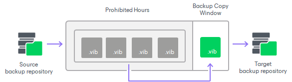

# Backup Copy Window

In this article

A backup copy window is a period of time when a backup copy job is allowed to transport data between source and target repositories.

By default, the backup copy window is configured to allow data transfer at any time. If you do not want the backup copy job to overlap the production hours, you can reduce the backup copy window and specify "prohibited" hours.

During the prohibited hours Veeam Backup & Replication cannot transfer data between source and target repositories. Other aspects of how Veeam Backup & Replication behaves during the prohibited hours and backup copy window depend on the selected [backup copy mode](backup_copy_modes.md). For more information, see [Backup Copy Window and Prohibited Hours in Immediate Copy Mode](#immediate) and [Backup Copy Window and Prohibited Hours in Periodic Copy Mode](#periodic).

|  |
| --- |
| Note |
| During the prohibited hours, Veeam Backup & Replication stops only data transferring operations. Transformation processes in the target repository are still performed. For more information, see [Transformation Processes](backup_copy_transform_operations.md). |

Backup Copy Window and Prohibited Hours in Immediate Copy Mode

When the prohibited hours start, Veeam Backup & Replication stops backup copy job sessions during which data transfer was not finished and assigns Failed to the session statuses. During the prohibited hours, Veeam Backup & Replication does not start new backup copy job sessions.

When the backup copy window starts, Veeam Backup & Replication transfers all restore points that were not transferred and creates as many incremental backup files as were omitted.

Backup Copy Window and Prohibited Hours in Periodic Copy Mode

Backup copy job can not start during prohibited hours. If a prohibited time interval starts and backup copy job is still processing, it will cause backup copy job to stop.

Page updated 8/16/2024

Page content applies to build 13.0.1.1071
