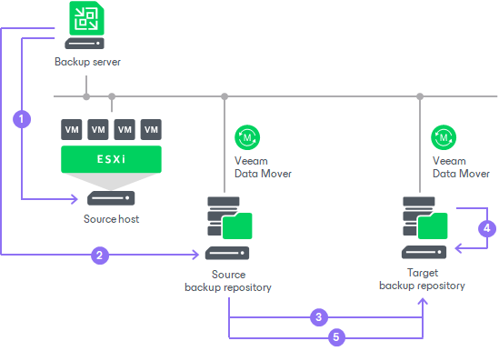
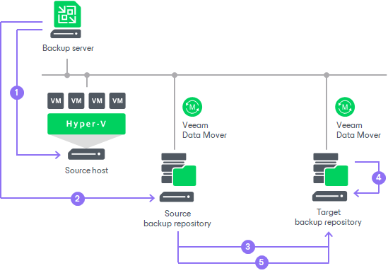

# How Backup Copy Works

In this article

Veeam Backup & Replication performs backup copy in the following way:

1. [For VM backup copy jobs only] Veeam Backup & Replication connects to vCenter Servers and ESXi hosts or Microsoft Hyper-V hosts to gather information about VMs whose restore points you want to copy.
2. For backup copying process, Veeam Backup & Replication starts two [Veeam Data Movers](veeam_transport_service.md) — source Veeam Data Mover and target Veeam Data Mover. Veeam Data Movers location depends on the backup repository type and data transport path. For more information, see [Backup Copy Architecture](backup_copy_path.md).
3. The first backup copy run always produces a full backup file. Veeam Backup & Replication copies data blocks that are necessary to build a full backup of a machine as of the most recent state.

Veeam Backup & Replication can copy data blocks from one or more backup files in the backup chain in the source backup repository.

+ If the backup chain is created in the reverse incremental backup method, Veeam Backup & Replication copies data blocks of the latest full backup.
+ If the backup chain is created in the forward or forever forward incremental backup method, Veeam Backup & Replication copies data blocks from the first full backup and a set of incremental backups.

To minimize the amount of traffic going over the network, you can set Veeam Backup & Replication to use WAN accelerator, data compression and deduplication technologies.

1. Veeam Backup & Replication transfers copied data to the target backup repository and writes all copied data blocks to the full backup file.

+ New backup copy jobs always use [per-machine backup with separate metadata files](per_vm_backup_files.md) chain format.
+ Backup copy jobs created in the previous versions of Veeam Backup & Replication that use [per-machine backup with a single metadata file](per_vm_backup_files.md#pervmdeprecated) are deprecated. If you want to upgrade Veeam Backup & Replication to version 13, you must upgrade the backup chain format beforehand, as described in section [Upgrading Backup Chain Formats](backup_copy_change_type.md).

1. During every next backup copy run, when a new restore point appears in the source backup repository, Veeam Backup & Replication copies incremental changes from this most recent restore point and transfers them to the target backup repository. Veeam Backup & Replication writes the copied data blocks to the incremental backup file in the target backup repository, that is, Veeam Backup & Replication creates a new restore point in the forever forward incremental backup chain.

To retain the desired number of restore points, Veeam Backup & Replication uses a retention policy. For more information, see [Short-Term Retention Policy](backup_copy_simple_retention.md).

If you want to store some restore points for longer periods (for weeks, months or years) and enable long-term retention policy (GFS retention policy), Veeam Backup & Replication creates a [forward incremental backup chain](forward_incremental_backup.md). For more information on GFS retention policy, see [Long-Term Retention Policy (GFS)](backup_copy_gfs.md).

 

In some cases, the source backup job and backup copy job may overlap. This situation can occur if the source backup job needs to transform the source backup chain.

If a specific task in the backup copy job locks the source backup chain to read data from it, and the source backup job that needs to write data to this backup chain starts at this moment (for example, for reverse incremental backup), the task in the backup copy job is put on hold. The backup copy job can continue processing other tasks that use other sources (for example, backup files created by other backup jobs). After the source backup job releases the backup chain, the backup copy job resumes processing machines in this backup chain.

Page updated 11/21/2025

Page content applies to build 13.0.1.1071
