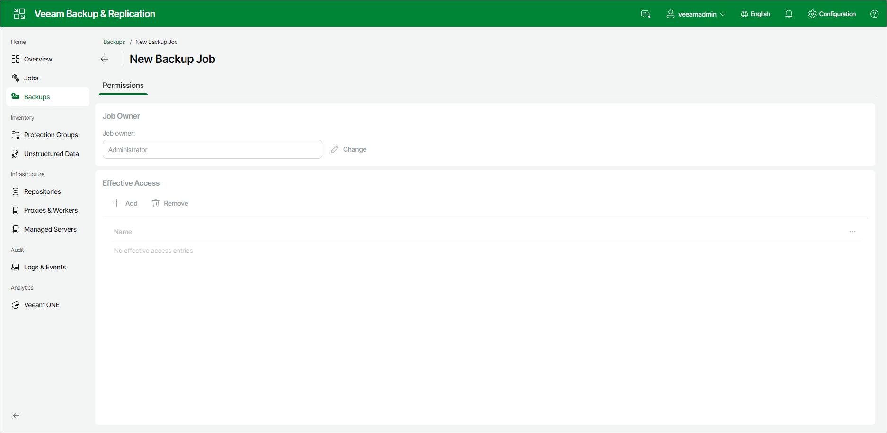

# Viewing Backup Permissions Using Web UI

On the Permissions tab, you can view who owns a backup and who can access it.

To open the tab, select the Backups node in the management pane, select the backup, and click Permissions.

A backup inherits its permissions from the backup job that created it. While that job exists, the Backup owner and Effective Access settings on this tab are read-only — you manage them on the job's [Permissions tab](job_details_permissions_web.md).

If you delete the backup job, the backup remains and you can manage its permissions directly on this tab:

Backup Owner

The Backup owner box shows the user account that owns the backup. To change the owner, do the following:

1. Click Change next to the Backup owner field.
2. Select the account that will own the backup.

Effective Access

By default, no users are granted access, and the Effective Access box shows No effective access entries. To grant access, do the following:

1. Click Add.
2. Select the user or group to add to the list.

To revoke access, select an entry in the list and click Remove.

Page updated 2026-08-04

