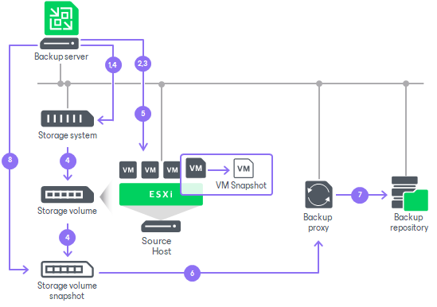

# Backup from Primary Storage Arrays

Backup from primary storage array allows you to use the backup from storage snapshots feature and create backups from snapshots created on primary storage arrays.

How Backup from Primary Storage Works

When you run a job with backup from storage snapshots enabled, Veeam Backup & Replication analyzes the job and divides the VMs into groups:

1. Analyzes which VMs in the job host their disks on the storage system. Checks the backup infrastructure and detects if there is a backup proxy that has a direct connection to the storage system.
2. Divides the VMs into groups based on the storage resources they share. VMs are placed in the same group if they reside on the same volume or LUN or belong to the same storage replication relationship.

Veeam Backup & Replication then processes the groups independently and in parallel — a group that finishes preparation starts processing without waiting for the others. For each group, Veeam Backup & Replication performs the following actions:

1. Triggers the vCenter Server to create VMware snapshots for the VMs in a group.
2. Requests the ESXi host to retrieve metadata about the layout of VM disks (physical addresses of data blocks). Veeam Backup & Replication also gets Changed Block Tracking (CBT) information for VMs hosted on the storage system.
3. Instructs the storage system to create a temporary snapshot of the storage volume or LUN that hosts VM disks and VMware snapshots.
4. Instructs the vCenter Server to remove VMware VM snapshots. The "cloned" VMware snapshots remain on the created temporary storage snapshots.
5. Mounts the temporary storage snapshot as a new volume to this backup proxy.
6. Reads and transports VM data blocks through the backup proxy to the backup repository. For incremental backup or replication, Veeam Backup & Replication uses obtained CBT data to retrieve only changed data blocks from the temporary storage snapshot.
7. When VM data processing is finished, Veeam Backup & Replication unmounts the temporary storage snapshot from the backup proxy and instructs the storage system to remove the temporary storage snapshot.

Grouping reduces both the storage space used by temporary snapshots and the time VMs spend under a snapshot, because the snapshots for each group are created and removed while that group is processed.

|  |
| --- |
| Note |
| Veeam Backup & Replication preserves the VM processing order within each group. However, because groups are processed in parallel, a group may start before another group that contains higher-priority VMs — so the actual start order can differ from the order configured in the job. If you need specific VMs to be processed first, add them to a separate job. |

Mixed Job Scenarios

Backup from storage snapshots is used only for those VMs whose disks are hosted on supported storage systems. As backup and replication jobs typically process a number of VMs that may reside on different types of storage, Veeam Backup & Replication processes VMs in mixed jobs in the following way:

* If a job processes a number of VMs whose disks are hosted on different types of storage, Veeam Backup & Replication uses backup from storage snapshots only for VMs whose disks are hosted on supported storage systems. Other VMs are processed in a regular manner.
* If a VM has several disks, some hosted on supported storage systems and some hosted on another type of storage, Veeam Backup & Replication does not use backup from storage snapshots to such VM. All disks of such VM are processed in a regular manner.

During a job, Veeam Backup & Replication does not make VMs on other storage wait for the storage-snapshot preparation. It processes VMs residing on different types of storage in parallel:

* For VMs whose disks are hosted on supported storage systems, Veeam Backup & Replication triggers VMware snapshots and storage snapshots. Preparing the storage snapshots takes extra time.
* For other VMs, Veeam Backup & Replication triggers VMware snapshots and starts processing them immediately, without waiting for the storage snapshots to be prepared.

Related Topics

[Configuring Backup from Storage Snapshots](storage_backup.md)

Page updated 2026-07-08

