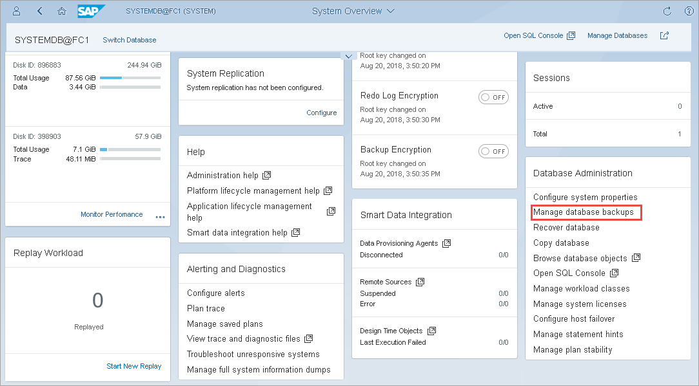
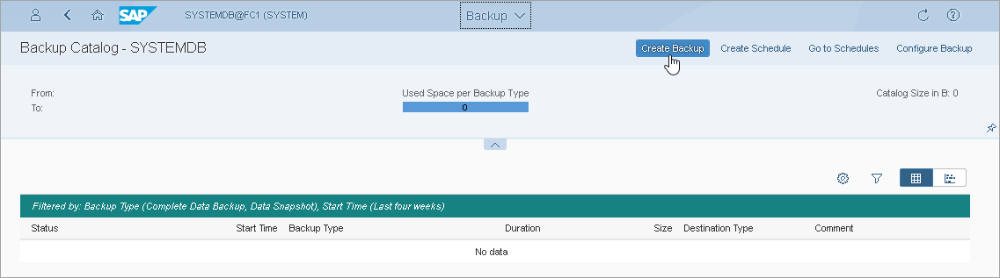

# Database Backup (SAP HANA Cockpit)

After you [configure Veeam Plug-In settings](configure_sap_hana_plugin.md), you can back up your databases with SAP HANA Cockpit 2.0. You can perform complete, incremental, and differential backups of SYSTEMDB and tenant databases. Veeam Plug-In will automatically transform backup files to Veeam backup repository. Keep in mind that you must select the Backint option as a destination target.

The example provided below is for demonstrating purposes only. For details on the full backup functionality of SAP HANA Cockpit, see [this SAP article](https://help.sap.com/docs/SAP_HANA_PLATFORM/6b94445c94ae495c83a19646e7c3fd56/f3ae772da42243dda1c0d9e34bceec0a.html?locale=en-US&version=2.0.05).

To perform Backint backup with SAP HANA Cockpit, do the following:

1. In the System Overview page, go to Database Administration and select Manage Database Backups.

1. At the Backup Catalog section, click Create Backup.

1. Specify backup settings:

1. Select the required backup type:

* Complete Data Backup: backup of all data structures required to recover the database.
* Incremental Data Backup: backup of data changed since the last full data backup or the last delta backup (incremental or differential).
* Differential Data Backup: backup of data changed since the last full data backup.

1. In the Destination Type setting, select Backint. With this option selected, Veeam Plug-In will transfer the backup to Veeam backup repository.
2. Change the default prefix for the backup file, if needed.
3. To start the backup, click Back Up.

