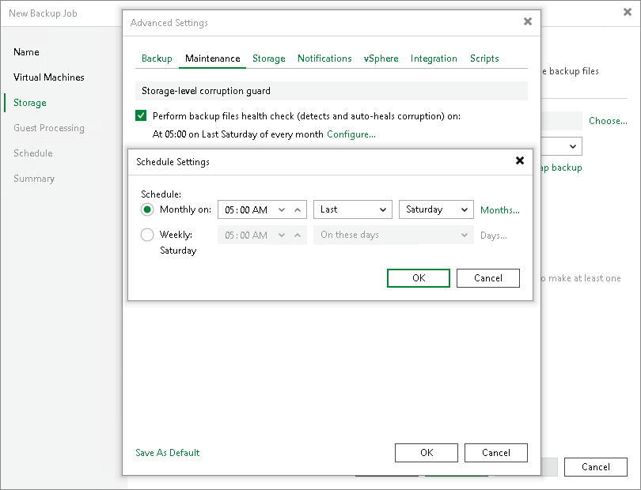
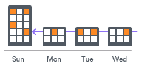
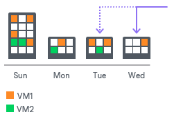
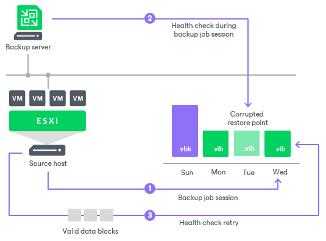
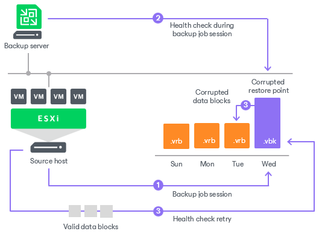

# Health Check for Backup Files

In this article

You can instruct Veeam Backup & Replication to periodically perform a health check for the latest restore point in the backup chain. During the health check, Veeam Backup & Replication performs a cyclic redundancy check (CRC) for metadata and a hash check for VM data blocks in the backup file to verify their integrity. The health check helps ensure that the restore point is consistent, and you can restore data from this restore point.

Health check can be performed for all types of backup chains:

* Forever Forward Incremental
* Forward Incremental
* Reverse Incremental (deprecated)

To run the health check periodically, you must enable the Perform backup files health check option in the backup job settings and define the health check schedule. By default, the health check is performed at 5:00 on the last Saturday of every month. You can change the schedule and run the health check weekly or monthly on specific days.

Verification Content

The health check always verifies only the latest restore point in the backup chain. In case of forever forward incremental and forward incremental backup chains, if the latest restore point is incomplete, the health check verifies the restore point preceding the latest one.

Note that the health check procedure verifies not the latest backup file in the backup chain, but the latest restore point for a VM. The latest restore point corresponds to the state of the VM at the date and time when the latest backup file for this VM was created. Data blocks that are required to "compose" the VM latest state are typically spread out across several backup files in the backup chain. Therefore, to verify the latest state of the VM, Veeam Backup & Replication must open several backup files in the backup chain and read data blocks from these backup files. For this reason, the health check procedure may take long.

The health check verifies only those virtual disks of a VM that are available in the latest restore point. For example, you added a VM with 3 virtual disks to a backup job. The VM was backed up Sunday through Tuesday. On Wednesday, you removed 1 virtual disk, and Veeam Backup & Replication run the health check for the VM. During the health check, Veeam Backup & Replication will verify only the 2 remaining virtual disks.

The health check verifies only those VMs that are available in the latest restore point. For example, you added 2 VMs to a backup job and ran the job several times. The health check verified 2 VMs. If you remove 1 VM from the backup job, the next scheduled health check run will verify the latest unverified restore point for the removed VM, and the latest restore point for the remaining VM. In future, the health check will verify only the restore point for the remaining VM in the job.

Limitations for Health Check

Consider the following limitations for the health check:

* For data blocks located in the capacity tier, the health check works as described in the [Health Check for Capacity Tier](hc_capacity_tier.md) section.
* [For per-machine backup chains] If you add a new VM to an existing backup job that has been run for some time, Veeam Backup & Replication will perform the health check for it during the next incremental backup job session for the added VM.
* Linux immutable repositories do not support repair. If the health check detects corrupted data, Veeam Backup & Replication marks the restore point as corrupted in the configuration database and finishes the health check session. In that case, you need to perform the active full backup for this backup chain. Otherwise, Veeam Backup & Replication will finish every backup job session creating subsequent incremental restore points with the Error status.

How Health Check Works

When Veeam Backup & Replication saves a new restore point to the backup repository, it calculates CRC values for backup metadata and hash values for data blocks of VM disk in the backup file, and saves these values in the metadata of the backup file, together with VM data. During the health check session, Veeam Backup & Replication uses these values to make sure that a verified restore point is consistent.

|  |
| --- |
| Note |
| If you perform health check for encrypted backup files, Veeam Backup & Replication will pass encryption keys to the regular backup repository or cloud repository. For more information on encryption, see [Data Encryption](data_encryption.md). |

Veeam Backup & Replication uses different mechanisms of health check for different types of backup chains:

* [Forever forward incremental and forward incremental backup chains](#forward)
* [Reverse incremental backup chains (deprecated)](#reversed)

Forever Forward Incremental and Forward Incremental Backup Chains

The health check for forward incremental backup chains is performed in the following way:

1. The health check starts according to the schedule. Depending on the storage type of the repository, the health check procedure can be performed on different infrastructure components:

* For [direct attached storage](backup_repository.md) — on the repository itself.
* For network attached storage — on the gateway server.
* For deduplicating storage appliances — on the gateway server.

|  |
| --- |
| Note |
| Consider the following:   * The gateway server placement may influence the time needed for the health check procedure when using network attached storage and deduplicating storage appliances as repositories. As the health check is performed on the gateway server, we recommend to locate gateway servers as close to the backup repository as possible. * The health check runs only after all jobs and operations that process a backup are completed (for example, a backup job, a restore job, synthetic operations with backups and so on). If some of these activities are started, the health check stops. * If a health check session does not complete until the next scheduled run, this session will stop and a new session will start according to the schedule. * If you add new VMs to a backup job which block data has been processed by the health check, the health check will verify only block data of new VMs and will skip backups of previously added VMs. |

1. The health check calculates CRC values for backup metadata and hash values for VM disks data blocks in the backup file and compares them with the CRC and hash values that are already stored in the backup file.

During the health check, Veeam Backup & Replication verifies the latest restore point in the backup chain (restore point created by the last backup job session). If the latest restore point in the backup chain is incomplete, Veeam Backup & Replication checks the restore point preceding the latest one.

1. If the health check does not detect data corruption, the backup job session completes in a regular way.

If the health check detects corrupted data, Veeam Backup & Replication completes the backup job with the Error status and starts the health check retry process. The health check retry starts as a separate backup job session.

Depending on the revealed data corruption, Veeam Backup & Replication performs the following actions:

+ If the health check has detected corrupted backup metadata in the full backup file, Veeam Backup & Replication marks the backup chain starting from this full restore point as corrupted in the configuration database. During the health check retry, Veeam Backup & Replication transports data blocks of the whole VM image from the source datastore, creates a new full backup file in the backup repository and saves transported data blocks to it.
+ If the health check has detected corrupted backup metadata in the incremental backup file, Veeam Backup & Replication removes information about this incremental restore point and subsequent incremental restore points from the configuration database. During the health check retry, Veeam Backup & Replication transports new incremental data relative to the latest valid restore point in the backup chain from the source datastore, creates a new incremental backup file in the backup repository and saves transported data blocks to it.
+ If the health check has detected corrupted VM disk blocks in the full or incremental backup file, Veeam Backup & Replication marks the restore point that includes the corrupted data blocks and subsequent incremental restore points as corrupted in the configuration database. During the health check retry, Veeam Backup & Replication transports data blocks from the source datastore. In addition, Veeam Backup & Replication transports data blocks that have changed since the backup job session that has triggered the health check. Veeam Backup & Replication stores these data blocks to the latest restore point that has been created by the current backup job session (session that has triggered the health check retry).

Reverse Incremental Backup Chains (Deprecated)

In the case of [reverse incremental backup](backup_methods.md#ri_backup) chains, the health check always verifies only the latest restore point in the backup chain, which is always a full backup file.

The health check is performed in the following way:

1. The health check starts according to the schedule. Depending on the storage type of the repository, the health check procedure can be performed on different infrastructure components:

* For [direct attached storage](backup_repository.md) — on the repository itself.
* For network attached storage — on the gateway server.
* For deduplicating storage appliances — on the gateway server.

1. Veeam Backup & Replication verifies the full backup file. It calculates CRC values for backup metadata and hash values for VM disks data blocks in the full backup file, and compares them with the CRC and hash values that are already stored in the full backup file.
2. If the health check does not detect data corruption, the backup job session completes in a regular way.

If the health check detects corrupted data, Veeam Backup & Replication completes the backup job with the Error status and starts the health check retry process. The health check retry starts as a separate backup job session.

Depending on the revealed data corruption, Veeam Backup & Replication performs the following actions:

+ If the health check has detected corrupted backup metadata in the full backup file, Veeam Backup & Replication marks the whole backup chain (full backup file and preceding reverse incremental backup files) as corrupted in the configuration database. During the health check retry, Veeam Backup & Replication transports data blocks of the whole VM image from the source datastore, creates a new full backup file in the backup repository and saves transported data blocks to it.
+ If the health check has detected corrupted VM disk blocks in the full backup file, Veeam Backup & Replication marks the full backup file and preceding reverse incremental backup files as corrupted in the configuration database. During the health check retry, Veeam Backup & Replication transports data blocks from the source datastore. In addition, Veeam Backup & Replication transports data blocks that have changed since the backup job session that has triggered the health check. Veeam Backup & Replication stores these data blocks to the existing full backup file in the backup repository. Corrupted data blocks that have been replaced with data blocks from the source datastore are stored to an existing reverse incremental backup file preceding the full backup file.

Health Check Retry Mode

If the health check detects corrupted data, the backup job will switch to the Retry mode and will start the health check retry process. During the health check retry, Veeam Backup & Replication transports data blocks of the whole VM image from the source datastore, creates a new full backup file in the object storage repository and saves transported data blocks to it.

If Veeam Backup & Replication fails to fix the corrupted data during all health check retries, you must retry the job manually. In this case, Veeam Backup & Replication will transport the required data blocks from the source datastore, to fix the latest restore point. If the latest restore point in the backup chain is incomplete, Veeam Backup & Replication will attempt to fix the restore point preceding the latest one.

For scheduled jobs, the number of health check retries is equal to the number of job retries specified in the job settings. For jobs started manually, Veeam Backup & Replication performs 1 health check retry.

|  |
| --- |
| Important |
| To allow Veeam Backup & Replication add the repaired data blocks to the latest restore point after completing the health check, the backup job must meet the following requirements:   * You must schedule the backups job to run automatically. For more information, see the [Schedule](backup_job_schedule_vm.md) step of the New Backup Job wizard. * The target object storage is not set to the Maintenance mode. * Backup window settings must allow a backup job to run after the health check completes.   If the backup job does not meet these requirements, Veeam Backup & Replication will add the repaired data blocks to a new restore point, created during a next run of the backup job. |

Related Topics

[Creating Backup Jobs](backup_job.md)

[Backup Methods](backup_methods.md)

[Forever Forward Incremental Backup](incremental_forever_backup.md)

[Forward Incremental Backup](forward_incremental_backup.md)

[Reverse Incremental Backup (Deprecated)](reversed_incremental_backup.md)

Page updated 8/13/2025

Page content applies to build 13.0.1.1071
