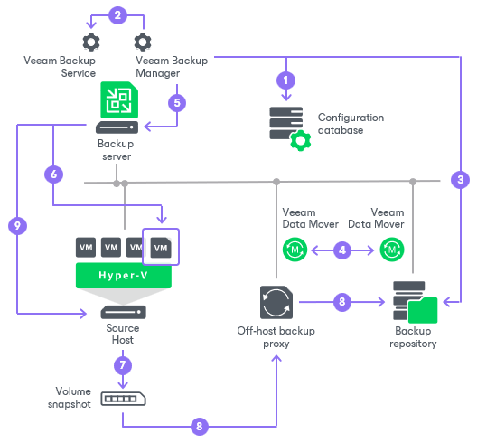

# How Backup Works

Veeam Backup & Replication performs VM backup in the following way:

1. When a new backup job session starts, Veeam Backup & Replication starts the Veeam Backup Manager process on the backup server. Veeam Backup Manager reads job settings from the configuration database and creates a list of VM tasks to process. For every disk of VMs added to the job, Veeam Backup & Replication creates a new task.
2. Veeam Backup Manager connects to the Veeam Backup Service. The Veeam Backup Service includes a resource scheduling component that manages all tasks and resources in the backup infrastructure. The resource scheduler checks what backup infrastructure resources are available and assigns backup proxies and backup repositories to process job tasks.
3. Veeam Backup Manager establishes a connection with [Veeam Data Movers](veeam_transport_service.md) on the target backup repository and backup proxy (off-host or Hyper-V host that performs the role of the backup proxy) and sets a number of rules for data transfer, such as network traffic throttling rules, and so on.
4. Veeam Data Movers on the backup proxy and backup repository establish a connection with each other for data transfer.
5. Veeam Backup Manager queries information about VMs and virtualization hosts from Microsoft Hyper-V.
6. If application-aware image processing is enabled for the job, Veeam Backup & Replication connects to VM guest OSes, deploys non-persistent runtime components or, if necessary, persistent agent components on VM guest OSes and performs in-guest processing tasks.
7. Veeam Backup & Replication requests Microsoft Hyper-V VSS to create a cohesive point-in-time copy of a VM. Microsoft Hyper-V VSS creates a volume snapshot or VM checkpoint, depending on the hypervisor version.
8. The source Veeam Data Mover reads the VM data from the volume snapshot or VM checkpoint and transfers the data to the backup repository in one of the transport modes. During incremental job sessions, the source Veeam Data Mover uses CBT to retrieve only those data blocks that have changed since the previous job session. If CBT is not available, the source Veeam Data Mover interacts with the target Veeam Data Mover on the backup repository to obtain backup metadata and uses this metadata to detect blocks that have changed since the previous job session.

While transporting VM data, the source Veeam Data Mover performs additional processing. It filters out zero data blocks, blocks of swap files and blocks of excluded VM guest OS files. The source Veeam Data Mover compresses VM data and transports it to the target Veeam Data Mover.

1. After the backup proxy finishes reading VM data, Veeam Backup & Replication requests Microsoft Hyper-V VSS to perform cleanup operations.

Related Topics

* [Backup Infrastructure for Backup](backup_architecture_hv.md)
* [Backup of VMs on Local Storage and CSV](backup_process.md)
* [Backup of VMs on Microsoft SMB3](hv_smb3_intro.md)
* [Data Compression and Deduplication](compression_deduplication_hv.md)

