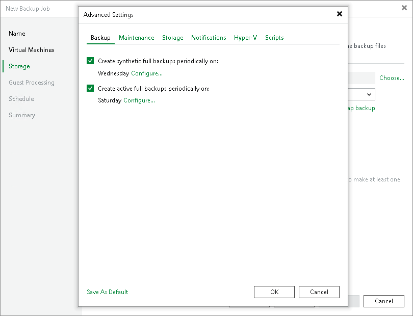

# Backup Settings

To specify settings for a backup chain created by the backup job:

1. At the Storage step of the wizard, click Advanced job settings.
2. Click the Backup tab.
3. You can select to periodically create synthetic full backups if you choose the incremental backup method. Select the Create synthetic full backups periodically on check box and click Configure to schedule synthetic full backups on the necessary days of the week.

1. You can select to periodically create active full backups with any backup mode enabled. Select the Create active full backups periodically on check box and click Configure to define scheduling settings.

Before you schedule periodic full backups, you must ensure you have enough free space in the backup repository. As an alternative, you can create active full backups manually when needed. For more information, see [Active Full Backup](active_full_backup_hv.md).

1. If you want to save this set of settings as the default one, click Save as default. When you create a new job, the saved settings will be offered as the default. This also applies to all users added to the backup server.

|  |
| --- |
| Important |
| Consider the following:   * If you schedule the active full backup and synthetic full backup on the same day, Veeam Backup & Replication will perform only the active full backup. Synthetic full backup will be skipped. * If you schedule a job to start after another job (initial job), but the initial job does not run on days when the synthetic or active full backup is scheduled for the chained job, Veeam Backup & Replication will not create active or synthetic full backups. For more information on the job schedule options, see [Define Job Schedule](backup_job_schedule_hv.md).  * Synthetic full backups cannot be created independently for backup jobs targeted at object storage. To include synthetic full backups in the backup process, you must enable the GFS policy. |

