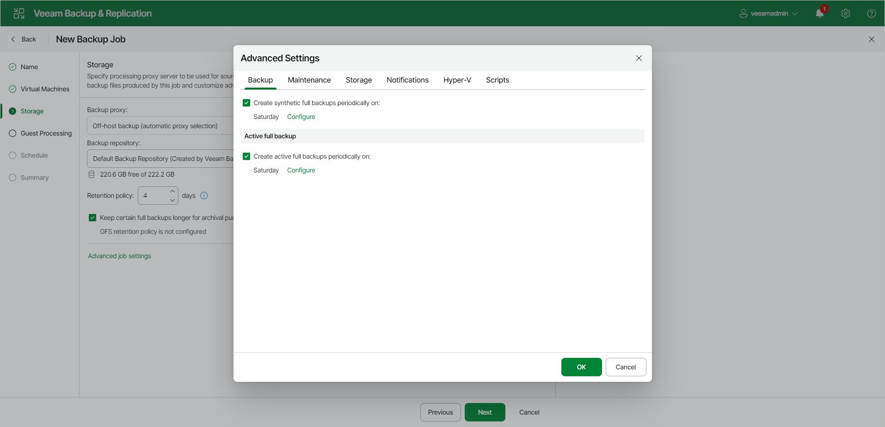

# Backup Settings

To specify settings for a backup chain created by the backup job:

1. At the Storage step of the wizard, click Change default advanced settings next to the Advanced settings.
2. Click the Backup tab.
3. You can select to periodically create synthetic full backups if you choose the incremental backup method. Set the Create synthetic full backups periodically on toggle to On and schedule synthetic full backups on a Weekly or Monthly basis.
4. You can select to periodically create active full backups with any backup mode enabled. Set the Create active full backups periodically on toggle to On and schedule active full backups on a Weekly or Monthly basis.

Before you schedule periodic full backups, you must ensure you have enough free space in the backup repository. As an alternative, you can create active full backups manually when needed. For more information, see [Active Full Backup](active_full_backup_hv.md).

|  |
| --- |
| Important |
| Consider the following:   * If you schedule the active full backup and synthetic full backup on the same day, Veeam Backup & Replication will perform only the active full backup. Synthetic full backup will be skipped.  * If you schedule a job to start after another job (initial job), but the initial job does not run on days when the synthetic or active full backup is scheduled for the chained job, Veeam Backup & Replication will not create active or synthetic full backups. For more information on the job schedule options, see [Define Job Schedule](backup_job_schedule_hv_web.md).  * Synthetic full backups cannot be created independently for backup jobs targeted at object storage. To include synthetic full backups in the backup process, you must enable the GFS policy. |

Page updated 2026-07-17

