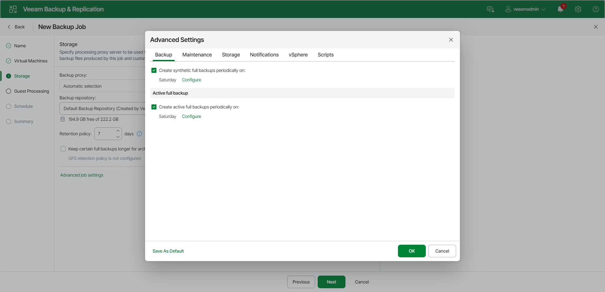

# Backup Settings

To specify settings for a backup chain created by the backup job:

1. At the Storage step of the wizard, click Change default advanced settings next to the Advanced settings.
2. Click the Backup tab.
3. You can select to periodically create synthetic full backups if you choose the incremental backup method. Set the Create synthetic full backups periodically on toggle to On and schedule synthetic full backups on a Weekly or Monthly basis.
4. You can select to periodically create active full backups with any backup mode enabled. Set the Create active full backups periodically on toggle to On and schedule active full backups on a Weekly or Monthly basis.

Before you schedule periodic full backups, you must ensure you have enough free space in the backup repository. As an alternative, you can create active full backups manually when needed. For more information, see [Active Full Backup](active_full_backup.md).

|  |
| --- |
| Important |
| Consider the following:   * If you schedule the active full backup and synthetic full backup on the same day, Veeam Backup & Replication will perform only the active full backup. Synthetic full backup will be skipped.  * If you schedule a job to start after another job (initial job), but the initial job does not run on days when the synthetic or active full backup is scheduled for the chained job, Veeam Backup & Replication will not create active or synthetic full backups. For more information on the job schedule options, see [Define Job Schedule](backup_job_schedule_vm_web.md).  * Synthetic full backups cannot be created independently for backup jobs targeted at object storage. To include synthetic full backups in the backup process, you must enable the GFS policy. |

1. In the VMware Tools section, set the Enable VMware Tools quiescence toggle to On to freeze the file system of processed VMs during backup.

Depending on the VM version, Veeam Backup & Replication will use the VMware FileSystem Sync Driver (vmsync) or VMware VSS component in VMware Tools for VM snapshot creation. These tools are responsible for quiescing the VM file system and bringing the VM to a consistent state suitable for backup. For more information, see [VMware Tools Quiescence](tools_quiescence.md).

1. In the Changed block tracking section, configure VMware vSphere CBT:

1. Ensure that the Use changed block tracking data toggle is set to On if you want to enable CBT.
2. Ensure that the Enable CBT for all protected VMs automatically toggle is set to On if you want to force using CBT even if CBT is disabled in VM configuration.
3. Ensure that the Reset CBT on each Active Full Backup automatically toggle is set to On if you want to reset CBT before Veeam Backup & Replication creates active full backups.

CBT reset helps avoid issues, for example, when CBT returns incorrect changed data.

For more information on CBT, see [Changed Block Tracking](changed_block_tracking.md).

|  |
| --- |
| Important |
| Consider the following:   * You can use CBT for VMs with virtual hardware version 7 or later. These VMs must not have existing snapshots.  * If you back up one VM with two different jobs, and the 1st job performs active full according to a schedule, the 2nd job, during an incremental run, will have to read the entire VMDK file of the processed VM. Therefore, the VM processing by a second job will take longer than during a normal incremental run. To avoid this behavior, set the Reset CBT on each Active Full Backup automatically toggle to Off for both jobs. |

Page updated 2026-07-17

