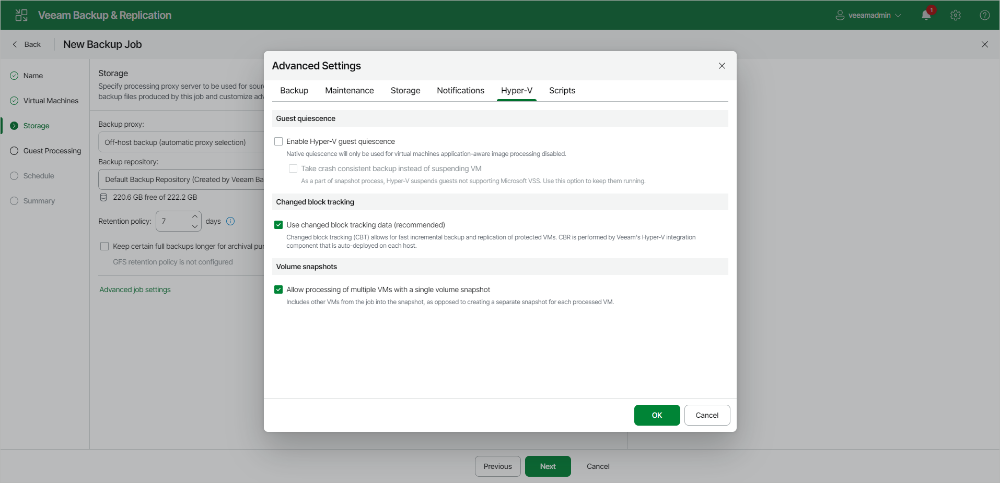

# Hyper-V Settings

To specify Hyper-V settings for the backup job:

1. At the Storage step of the wizard, click Advanced job settings.
2. Click the Hyper-V tab.
3. In the Guest quiescence section, specify which backup method must be used to prepare the VM guest OS for backup.

Typically, it is recommended that you use Veeam application-aware processing that leverages the Microsoft VSS framework to prepare the VM guest OS for backup. If you cannot use application-aware processing for some reason, select the Enable Hyper-V guest quiescence check box. Veeam Backup & Replication will select the backup method in the following way:

+ If a VM meets all requirements for online backup, Veeam Backup & Replication will use the online backup method.
+ If a VM does not meet the requirements for online backup, Veeam Backup & Replication will use the offline backup method. Note that during offline backup, a VM is suspended for a short period of time.

The selected backup method applies to all VMs in the job. However, if you enable application-aware processing for VMs, the application-aware processing settings will have higher priority than the selected backup method.

|  |
| --- |
| Note |
| For VMs on Microsoft Hyper-V Server 2016 and later, consider the following:   * You cannot use offline backup. * If you enable Hyper-V guest quiescence and leave application-aware processing disabled in the job, Veeam Backup & Replication performs a backup using the VSS\_BT\_FULL method. This method backs up databases and transaction logs and then truncates the transaction logs. For more information on backup methods, see [this Microsoft Documentation](https://docs.microsoft.com/en-us/windows/win32/vss/vss-backup-state).   You can change the backup method to VSS\_BT\_COPY in the in the configuration file on the Linux-based backup server or with a registry value on the Microsoft Windows-based backup server. For more information, contact Veeam Customer Support. |

1. If you do not want to suspend VMs in the job, select the Take crash consistent backup instead of suspending VM check box. In this case, Veeam Backup & Replication will create a crash-consistent backup of a VM.
2. In the Changed block tracking section, specify if CBT must be used for VM backup. By default, this option is enabled. CBT dramatically reduces the load on the production environment and the time required to perform incremental backups.
3. If you have added several VMs to the job, select the Allow processing of multiple VMs with a single volume snapshot check box. This option helps reduce snapshot workload in the Microsoft Hyper-V environment. When the job starts, Veeam Backup & Replication will group VMs and trigger Microsoft Hyper-V to create one volume snapshot for a group of VMs instead of a volume snapshot per each processed VM.

Veeam Backup & Replication can create a single volume snapshot for a group of VMs that meet the following requirements:

+ VMs must be located on the same host.
+ Volumes on which VM files reside must use the same VSS provider for snapshot creation.
+ The number of VMs in the group is limited: for a software VSS provider — 4 VMs, for a hardware VSS provider — 8 VMs.
+ Veeam Backup & Replication groups VMs based on the method of snapshot creation that is used for backup: transactionally consistent (VSS) or crash-consistent.

For example, you add to the job 2 VMs that are registered on the same host. VM1 resides on volume C:\ and VM2 resides on volume D:\. Both VMs use Microsoft Software Shadow Copy Provider. In this situation, Veeam Backup & Replication will create a single snapshot for these VMs.

|  |
| --- |
| Note |
| The Allow processing of multiple VMs with a single volume snapshot option is not applicable to VMs registered on Microsoft Hyper-V Server 2016 and later that are processed in the on-host backup mode. |

