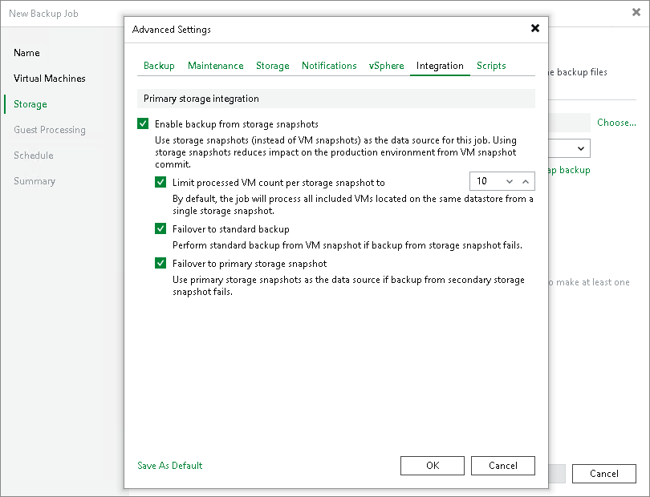

# Integration Settings

In this article

On the Integration tab, you can define whether you want to use the Backup from Storage Snapshots technology to create the backup. Backup from Storage Snapshots lets you leverage storage snapshots for VM data processing. The technology improves RPOs and reduces the impact of backup activities on the production environment.

Before you start using the Backup from Storage Snapshots technology, check the prerequisites. For more information, see the [Requirements and Limitations (Storage Systems)](storage_limitations.md) section.

To specify storage integration settings for the backup job:

1. At the Storage step of the wizard, click Advanced job settings.
2. Click the Integration tab.
3. By default, the Enable backup from storage snapshots option is enabled. If you do not want to use Backup from Storage Snapshots, clear this check box. For more information, see [Configuring Backup from Storage Snapshots](storage_backup.md) section.
4. If you add to the job many VMs whose disks are located on the same volume or LUN, select the Limit processed VM count per storage snapshot to <N> check box and specify the number of VMs for which one storage snapshot must be created. Veeam Backup & Replication will divide VMs into several groups and trigger a separate storage snapshot for every VM group. As a result, the job performance will increase.

For more information, see [Limitation on Number of VMs per Snapshot](storage_limiting.md) section.

1. If Veeam Backup & Replication fails to create a storage snapshot, VMs whose disks are located in the storage system will not be processed by the job. To fail over to the regular VM processing mode and back up or replicate such VMs in the regular processing mode, select the Failover to standard backup check box.
2. [For secondary NetApp, HPE Nimble and HPE 3PAR storage systems] If Veeam Backup & Replication cannot create a storage snapshot on secondary storage arrays, the job will not back up VMs whose disks are located on the storage system. To fail over to Backup from Storage Snapshots on the production storage, select the Failover to primary storage snapshot check box. If Veeam Backup & Replication fails to create a storage snapshot on secondary storage arrays, it will trigger the storage snapshot on primary storage arrays and use it as a source for backup. Note, however, that Backup from Storage Snapshots on primary storage arrays will put an additional load on the production environment.

Page updated 6/30/2025

Page content applies to build 13.0.1.1071
