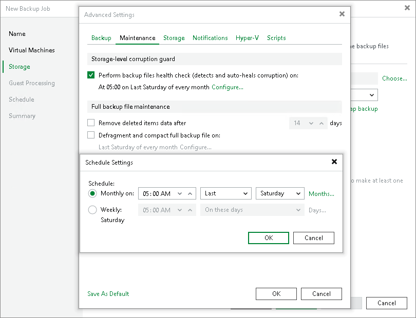

# Maintenance Settings

In this article

You can instruct Veeam Backup & Replication to periodically perform the health check for the latest restore point in the backup chain and maintenance operations to ensure the backup chain remains valid and consistent.

To specify the health check and maintenance settings, at the Storage step of the New Backup Job wizard, click Advanced job settings and click the Maintenance tab.

Specifying Health Check Settings

To specify health check settings for the backup job:

1. In the Storage-level corruption guard section, select the Perform backup files health check on check box and specify the schedule for the health check. By default, if the health check is enabled, it is performed monthly at 5:00 AM every last Saturday.
2. To specify the health check schedule, click the Configure link.
3. In the Schedule Settings window, specify whether you want to perform the health check monthly or weekly and specify the schedule settings.

Specifying Backup File Maintenance

To specify maintenance settings for the backup job:

1. To specify the retention period for deleted VMs, select the Remove deleted items data after check box and specify the number of days for which you want to keep backup data for deleted VMs.

|  |
| --- |
| Note |
| Consider the following:   * If a VM is no longer available (for example, it was deleted or excluded from the job), Veeam Backup & Replication will keep its data in the backup repository for the period that you have specified. When this period is over, data from the deleted VM will be removed from the backup repository. * By default, the retention period for deleted VM data is 14 days. It is strongly recommended that you set the retention period to 3 days or more to prevent unwanted data loss. For more information, see [Retention Policy for Deleted Items](retention_deleted_vms_hv.md). |

1. To periodically compact a full backup, select the Defragment and compact full backup file on check box.

|  |
| --- |
| Important |
| Consider the following:   * Direct backup to object storage repositories does not support the Defragment and compact full backup file option. * The HPE StoreOnce backup repository does not support the Defragment and compact full backup file option. |

1. To specify the schedule for the compact operation, click the Configure link.

1. In the Schedule Settings window, specify whether you want to compact a full backup monthly or weekly and specify the schedule settings.
2. If you want to save this set of settings as the default one, click Save as default. When you create a new job, the saved settings will be offered as the default. This also applies to all users added to the backup server.

|  |
| --- |
| Important |
| If you schedule periodic full backups, the Defragment and compact full backup file check box does not apply. |

Page updated 7/3/2025

Page content applies to build 13.0.1.1071
