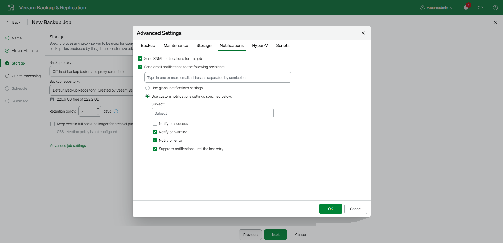

# Notification Settings

To specify notification settings for the backup job:

1. At the Storage step of the wizard, click Change default advanced settings next to the Advanced settings.
2. Click the Notifications tab.
3. Set the Send SNMP Notifications for This Job toggle to On if you want to receive SNMP traps when the job completes successfully.

SNMP traps will be sent if you specify global SNMP settings in Veeam Backup & Replication and configure software on the recipient's machine to receive SNMP traps. For more information, see [Specifying SNMP Settings](snmp_settings.md).

1. Set the Send Email Notifications to the Following Recipients toggle to On if you want to receive notifications about the job completion status by email. In the field under the toggle, specify recipient email addresses. You can enter several addresses separated by a semicolon.

Email notifications will be sent if you configure global email notification settings in Veeam Backup & Replication. For more information, see [Configuring Global Email Notification Settings](general_email_notifications.md).

1. You can choose to use global notification settings or specify custom notification settings.

* To receive a typical notification for the job, select Use Global Notification Settings. In this case, Veeam Backup & Replication will apply to the job global email notification settings specified for the backup server. For more information, see [Configuring Global Email Notification Settings](general_email_notifications.md).
* To configure a custom notification for the job, select Use Custom Notification Settings Specified Below option. You can specify the following notification settings:

1. In the Subject field, specify a notification subject. You can use the following variables in the subject: %Time% (completion time), %JobName%, %JobResult%, %VmCount% (number of VMs in the job) and %Issues% (number of VMs in the job that have been processed with the Warning or Failed status).
2. Select the Notify on Success, Notify on Warning and Notify on Error check boxes to receive email notification if the job completes successfully, fails, or completes with a warning.
3. Select the Suppress Notifications Until the Last Retry check box to receive a notification about the final job status. If you do not enable this option, Veeam Backup & Replication will send one notification per every job retry.

Page updated 2026-07-17

