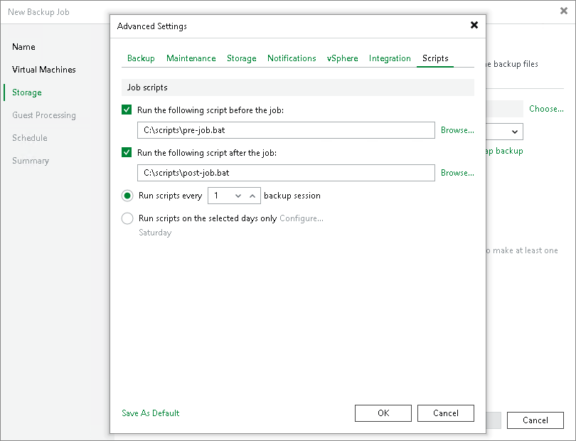

# Script Settings

To specify script settings for the backup job:

1. At the Storage step of the wizard, click Advanced job settings.
2. Click the Scripts tab.
3. If you want to execute custom scripts before and after the backup job, select the Run the following script before the job and Run the following script after the job check boxes and click Browse to choose executable files from a local folder on the backup server. The scripts are executed on the backup server.

You can select to execute pre- and post-backup actions after a number of backup sessions or on specific week days.

+ If you select the Run scripts every <N> backup session option, specify the number of the backup job sessions after which the scripts must be executed.
+ If you select the Run scripts on the selected days only option, click Days and specify week days on which the scripts must be executed.

|  |
| --- |
| Note |
| Consider the following:   * Custom scripts you define in the Advanced job settings relate to the backup job itself, not the VM quiescence process. To add pre-freeze and post-thaw scripts for VM image quiescence, use the Guest Processing step of the wizard. * If you select the Run scripts on the selected days only option, Veeam Backup & Replication executes scripts only once on each selected day — when the job runs for the first time. During subsequent job runs, scripts are not executed. * Veeam Backup & Replication executes the post-job scripts regardless of whether the job succeeded or failed. * For a scheduled job that fails, Veeam Backup & Replication executes the post-job scripts only after all retry attempts have been exhausted. * For a manually started job that fails, Veeam Backup & Replication executes the post-job scripts on the first attempt, since the manually started jobs do not have any retry attempts. * To run the script, Veeam Backup & Replication uses the service account under which the Veeam Backup Service is running. * To learn more about script limitations for a job created on a Linux-based backup server, see section [Scripts](backup_job_limitations.md#scripts_limitations). |

