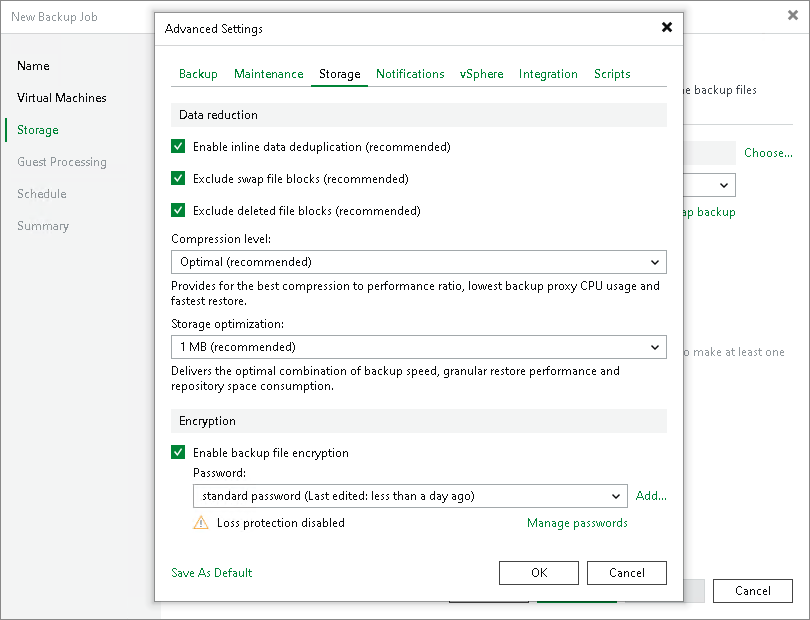

# Storage Settings

To specify storage settings for the backup job:

1. At the Storage step of the wizard, click Advanced job settings.
2. Click the Storage tab.
3. To disable data deduplication, clear the Enable inline data deduplication check box. When you disable data deduplication, you also change the workflow for incremental backups. If [Changed Block Tracking](changed_block_tracking.md) (CBT) is enabled for the job, Veeam Backup & Replication will save all data blocks marked by CBT as new to the destination storage without performing an additional check or using Veeam filtering mechanism. It will result in faster creation of incremental backups. However, backup files may increase in size.

By default, Veeam Backup & Replication deduplicates VM data before storing it in the backup repository. Data deduplication provides a smaller backup file size but may reduce the backup job performance. For more information on data deduplication, see [Deduplication](compression_deduplication.md#dedup).

|  |
| --- |
| Note |
| The option that allows you to enable or disable data deduplication is not available for an object storage repository due to its underlying functionality. The backup to object storage applies various improvements to optimize storage consumption and make the backup process faster.  If you have selected such a repository at the Storage step of the wizard, the Enable inline data deduplication check box will not be displayed. |

1. To include data blocks of the hiberfil.sys file and pagefile.sys file in the backup, clear the Exclude swap file blocks check box. For more information, see [Swap Files](swap_files.md).

By default, Veeam Backup & Replication checks the NTFS MFT file on VMs with Microsoft Windows OS to identify data blocks of the hiberfil.sys file (file used for the hibernate mode) and pagefile.sys file (swap file) and excludes these data blocks from processing. The swap file is dynamic and changes intensively between backup job sessions, even if the VM itself does not change much. Processing of service files reduces the job performance and increases the size of incremental backup files.

1. To include dirty data blocks in the backup, clear the Exclude deleted file blocks check box. For more information, see [Deleted File Blocks (BitLooker)](dirty_blocks.md).

By default, Veeam Backup & Replication does not copy deleted file blocks ("dirty" blocks on the VM guest OS) to the target location. This option lets you reduce the size of backup files and increase job performance.

1. From the Compression level list, select a compression level for the backup: None, Dedupe-friendly, Optimal, High or Extreme. For more information on data compression, see [Data Compression and Deduplication](compression_deduplication.md).
2. In the Storage optimization section, select the block size that will be used to process VMs. For more information on the data block sizes and how they affect performance, see [Storage Optimization](compression_deduplication.md#optimization).
3. To encrypt backup files, select the Enable backup file encryption check box. In the Password field, select the encryption method you want to use — a password that will generate secret keys or an external KMS server that will generate KMS keys. For more information about backup job encryption, see [Encrypting Backup Jobs](encrypting_backup_jobs.md).

If you have not created the password beforehand, click Add or use the Manage passwords link to specify a new password. For more information, see [Password Manager](password_manager.md).

If you do not use password loss protection, Veeam Backup & Replication will display a warning about it. For more information, see [Password Loss Protection](encryption_password_loss_protection.md).

