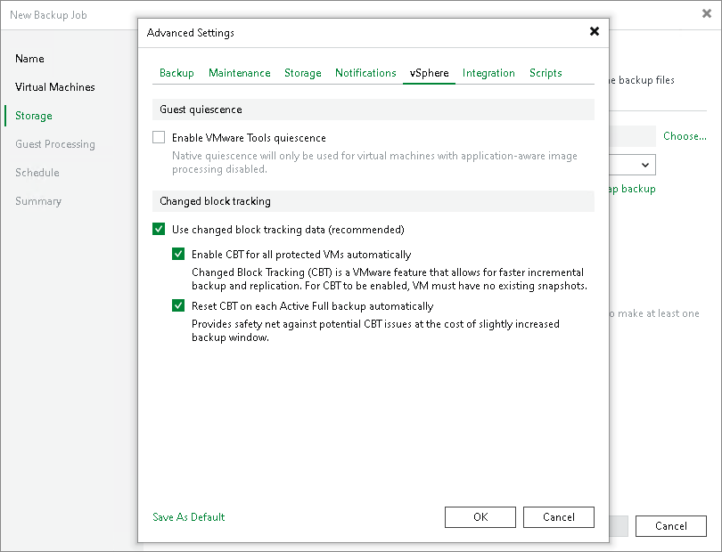

# vSphere Settings

In this article

To specify VMware vSphere settings for the backup job:

1. At the Storage step of the wizard, click Advanced job settings.
2. Click the vSphere tab.
3. Select the Enable VMware Tools quiescence check box to freeze the file system of processed VMs during backup.

Depending on the VM version, Veeam Backup & Replication will use the VMware FileSystem Sync Driver (vmsync) driver or VMware VSS component in VMware Tools for VM snapshot creation. These tools are responsible for quiescing the VM file system and bringing the VM to a consistent state suitable for backup. For more information, see [VMware Tools Quiescence](tools_quiescence.md).

1. In the Changed block tracking section, configure VMware vSphere CBT:

1. Ensure that the Use changed block tracking data check box is selected if you want to enable CBT.
2. Ensure that the Enable CBT for all protected VMs automatically check box is selected if you want to force using CBT even if CBT is disabled in VM configuration.
3. Ensure that the Reset CBT on each Active Full backup automatically check box is selected if you want to reset CBT before Veeam Backup & Replication creates active full backups.

CBT reset helps avoid issues, for example, when CBT returns incorrect changed data.

For more information on CBT, see [Changed Block Tracking](changed_block_tracking.md).

|  |
| --- |
| Important |
| Consider the following:   * You can use CBT for VMs with virtual hardware version 7 or later. These VMs must not have existing snapshots.  * If you back up one VM with two different jobs, and the 1st job performs active full according to a schedule, the 2nd job, during an incremental run, will have to read the entire VMDK file of the processed VM. Therefore, the VM processing by a second job will take longer than during a normal incremental run. To avoid this behavior, disable the Reset CBT on each Active Full backup automatically option for both jobs. |

Page updated 7/30/2025

Page content applies to build 13.0.1.1071
