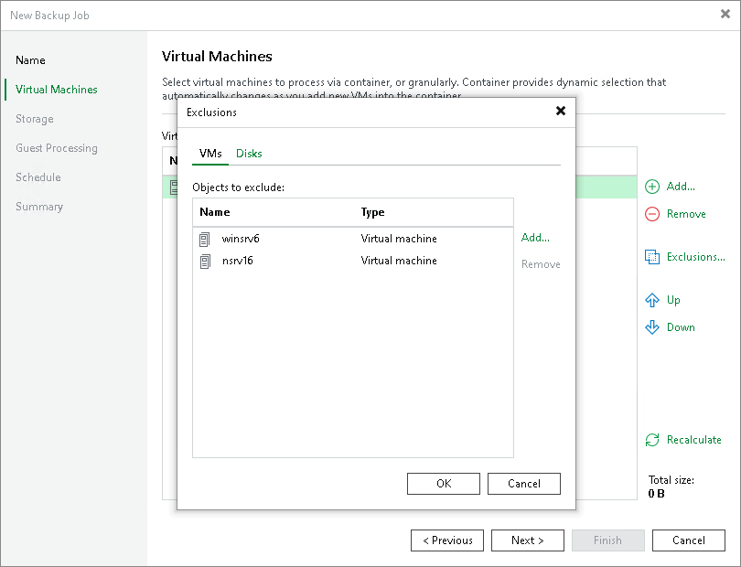
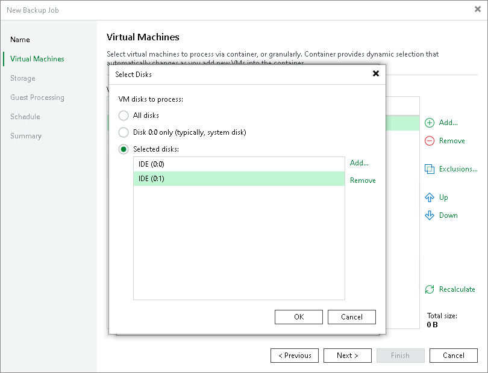

# Step 4. Exclude Objects from Backup Job

In this article

After you have added VMs and VM containers to the job, you can specify which objects you want to exclude from the backup. You can exclude the following types of objects:

* [VMs from VM containers](#vm)
* [Specific VM disks](#disk)

Exclude VMs from VM Container

To exclude VMs from a VM container:

1. At the Virtual Machines step of the wizard, click Exclusions.
2. Click the VMs tab.
3. Click Add.
4. Use the toolbar at the top right corner of the window to switch between views: Hosts and Clusters, Hosts and Volumes, VMs and Tags, VM Groups.

Note that VMs can be arranged in VM groups only on Microsoft Hyper-V hosts version 2016 or later.

1. In the displayed tree, select the object.
2. Click OK.

|  |
| --- |
| Note |
| Volumes on the dynamic disks must not be split. Spanned, striped and other types of split volumes cannot be excluded. |

Exclude VM Disks

To exclude VM disks from a backup:

1. At the Virtual Machines step of the wizard, click Exclusions.
2. Click the Disks tab.
3. Select the VM in the list and click Edit. If you want to exclude disks of a VM added as a part of the container, click Add to include the VM in the list as a standalone object.
4. Choose disks that you want to back up. You can choose to process all disks, 0:0 disks (typically, system disks) or add to the list custom IDE or SCSI disks.

|  |
| --- |
| Note |
| Consider the following:   * If you exclude disks from a backup and [enable application-aware processing](backup_job_vss_application_hv.md), Microsoft VSS framework will still process the disks and volumes on which the disks are located. * When you exclude disks from a backup, they will only be removed from the backup operation. It is important to note that even if a disk is excluded from the backup, it may still be included in a snapshot created by the hypervisor. |

Page updated 9/26/2025

Page content applies to build 13.0.1.1071
