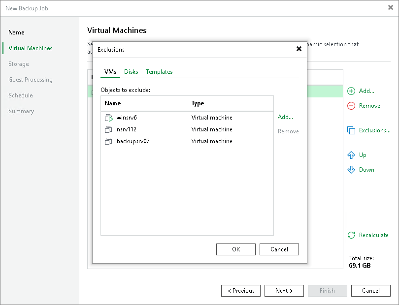
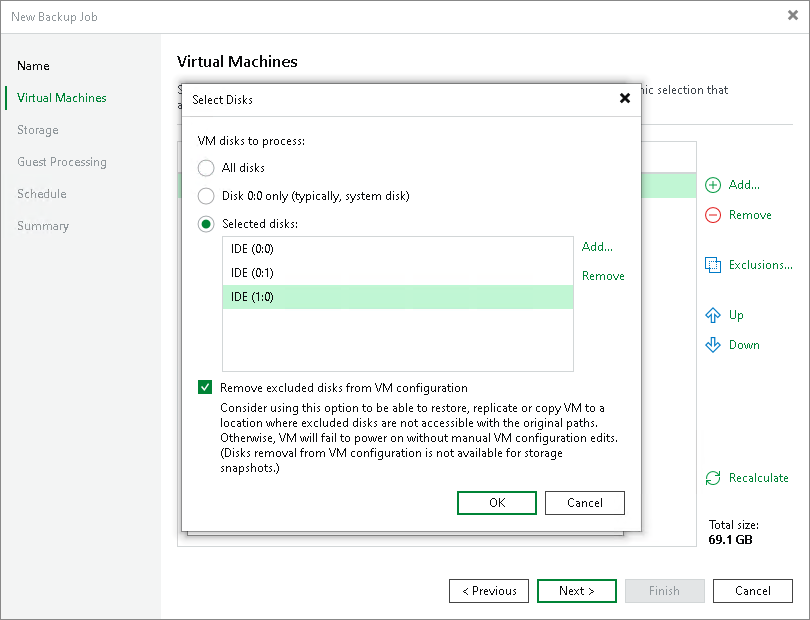
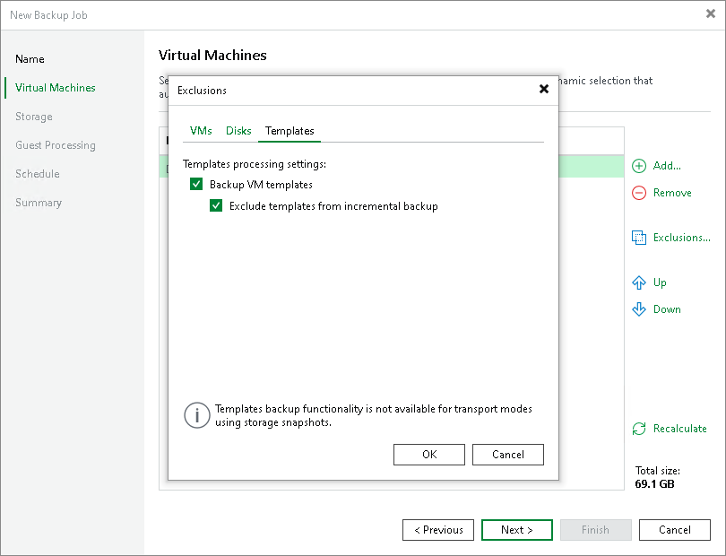

# Step 4. Exclude Objects from Backup Job

After you add VMs and VM containers to the job, you can specify which objects you want to exclude from the backup. You can exclude the following types of objects:

* [VMs from VM containers](#vm)
* [Specific VM disks](#disk)
* [VM templates](#template)

|  |
| --- |
| Note |
| Veeam Backup & Replication automatically excludes VM log files from backup to make the backup process faster and reduce the size of the backup file. |

Exclude VMs from VM Container

To exclude VMs from a VM container:

1. At the Virtual Machines step of the wizard, click Exclusions.
2. Click the VMs tab.
3. Click Add.
4. Use the toolbar at the top right corner of the window to switch between views. Depending on the view you select, some objects may not be available. For example, if you select Tags combination view, no resource pools, hosts or clusters will be displayed in the tree. In the Tags combination view, you can select multiple tags and only those VMs that have all the selected tags will be excluded from the job.
5. In the displayed tree, select the necessary object and click Add. Use the Show full hierarchy check box to display the hierarchy of all VMware Servers added to the backup infrastructure.
6. Click OK.

Exclude VM Disks

To exclude VM disks:

1. At the Virtual Machines step of the wizard, click Exclusions.
2. Click the Disks tab.
3. Select the VM in the list and click Edit. If you want to exclude disks of a VM added as part of the container, click Add to include the VM in the list as a standalone object.
4. Choose disks that you want to back up. You can choose to process all disks, 0:0 disks (typically, system disks) or add to the list custom IDE, SCSI or SATA disks.
5. Select the Remove excluded disks from VM configuration check box. Veeam Backup & Replication will modify the VMX file of a backed-up VM to remove excluded disks from the VM configuration. If you restore this VM from the backup file to a location where excluded disks are not accessible with the original paths, you will not have to manually edit the VM configuration file to be able to power on the VM.

|  |
| --- |
| Note |
| Consider the following:   1. If you exclude disks from a backup and [enable application-aware processing](backup_job_vss_application_vm.md), Veeam Backup & Replication will still perform application-aware processing for the excluded disks. This means that VSS will process disk data. 2. When you exclude disks from a backup, they will only be removed from the backup operation. It is important to note that even if a disk is excluded from the backup, it may still be included in a snapshot created by the hypervisor. |

Exclude VM Templates

To exclude VM templates:

1. At the Virtual Machines step of the wizard, select a VM container and click Exclusions.
2. Click the Templates tab.
3. Clear the Backup VM templates check box.
4. If you want to include VM templates into the full backup only, leave the Backup VM templates check box selected and select the Exclude templates from incremental backup check box.

|  |
| --- |
| Note |
| If you select Exclude templates from incremental backup check box, consider the following:   * Templates are excluded from both incremental and synthetic full backups.  * To retain more than one full backup, you must configure periodic active full backups. |

