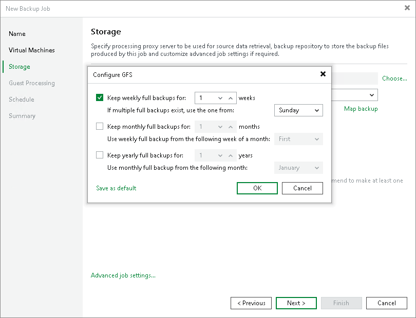

# Step 7. Configure Long-Term Retention

In this article

If you want to ignore the short-term retention policy for some full backups and store them for long-term archiving, you can configure GFS retention policy settings for the backup job. For more information on GFS and its limitations, see [Long-Term Retention Policy (GFS)](gfs_retention_policy_hv.md).

1. At the Storage step of the wizard, select the Keep certain full backups longer for archival purposes check box.
2. Click Configure.
3. In the Configure GFS window, do the following:

* If you want to create weekly restore points, select the Keep weekly full backups for check box. Then, specify the number of weeks during which you want to prevent restore points from being modified and deleted.

From the If multiple full backups exist, use the one from drop-down list select a week day when Veeam Backup & Replication must assign the weekly GFS flag to a full restore point.

* If you want to create monthly restore points, select the Keep monthly full backups for check box. Then, specify the number of months during which you want to prevent restore points from being modified and deleted.

From the Use weekly full backup from the following week of a month drop-down list, select a week when Veeam Backup & Replication must assign the monthly GFS flag to a full restore point. A week equals 7 calendar days; for example, the first week of May is days 1–7, and the last week of May is days 25–31.

* If you want to create yearly restore points, select the Keep yearly full backups for check box. Then, specify the number of years during which you want to prevent restore points from being modified and deleted.

From the Use monthly full backup from the following month drop-down list, select a month when Veeam Backup & Replication must assign the yearly GFS flag to a full restore point.

* If you want to save this set of settings as the default one, click Save as default. When you create a new job, the saved settings will be offered as the default. This also applies to all users added to the backup server.

|  |
| --- |
| Note |
| If you select to assign multiple types of GFS flags, the flags begin to depend on each other. For more information on this dependency, see [Algorithm for Multiple Flag Types](gfs_how_flags_assigned_hv.md#multiple). |

Page updated 7/3/2025

Page content applies to build 13.0.1.1071
