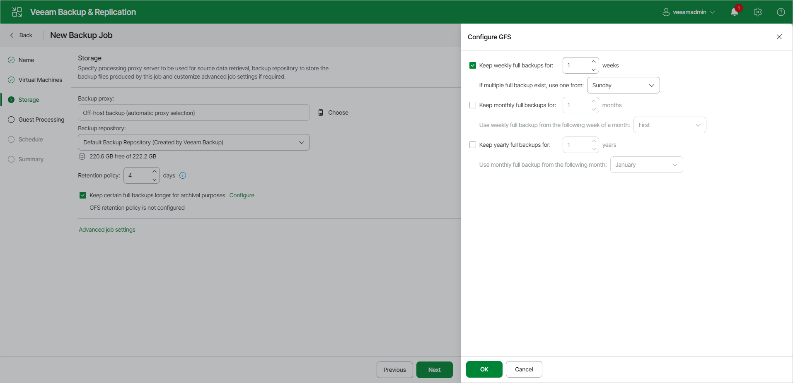

# Step 6. Configure Long-Term Retention

If you want to ignore the short-term retention policy for some full backups and store them for long-term archiving, you can configure a long-term retention policy (or GFS retention policy) for the backup job. For more information on GFS and its limitations, see [Long-Term Retention Policy (GFS)](gfs_retention_policy.md).

To configure a GFS retention policy, do the following:

1. At the Storage step of the wizard, click Configure next to the Keep certain full backups longer for archival purposes field.
2. In the Configure GFS Retention window, do the following:

* To create weekly restore points, set the Weekly full backups toggle to On.

From the Keep backups from drop-down list, select a week day when Veeam Backup & Replication must assign the weekly GFS flag to a full restore point. In the week(s) field, specify the number of weeks during which you want to prevent restore points from being modified and deleted.

* To create monthly restore points, set the Monthly full backups toggle to On.

From the Keep backups from drop-down list, select a week when Veeam Backup & Replication must assign the monthly GFS flag to a full restore point. A week equals 7 calendar days; for example, the first week of May is days 1–7, and the last week of May is days 25–31. In the month(s) field, specify the number of months during which you want to prevent restore points from being modified and deleted.

* To create yearly restore points, set the Yearly full backups toggle to On.

From the Keep backups from drop-down list, select a month when Veeam Backup & Replication must assign the yearly GFS flag to a full restore point. In the year(s) field, specify the number of years during which you want to prevent restore points from being modified and deleted.

|  |
| --- |
| Note |
| If you select to assign multiple types of GFS flags, the flags begin to depend on each other. For more information on this dependency, see [Algorithm for Multiple Flag Types](gfs_how_flags_assigned.md#multiple). |

Page updated 2026-07-15

