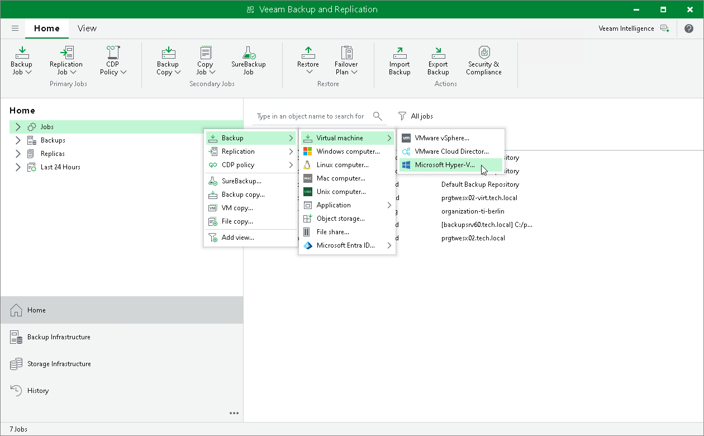

# Step 1. Launch New Backup Job Wizard

To launch the New Backup Job wizard, do one of the following:

* On the Home tab, click Backup Job > Virtual machine > Microsoft Hyper-V.
* Open the Home view. In the [inventory pane](vbr_ui.md), right-click Jobs and select Backup > Virtual machine > Microsoft Hyper-V.
* Open the Inventory view. In the working area, select the VMs, click Add to Backup on the ribbon and select New job or right-click the VMs and select Add to backup job > New job. Veeam Backup & Replication will start the New Backup Job wizard and add the VMs to this job. You can add other VMs to the job later on when you pass through the wizard steps.
* You can quickly add the VMs to an already existing job. To do this, open the Inventory view. In the working area, select the VMs and click Add to Backup > name of the job on the ribbon or right-click the VMs and select Add to backup job > name of the job.

