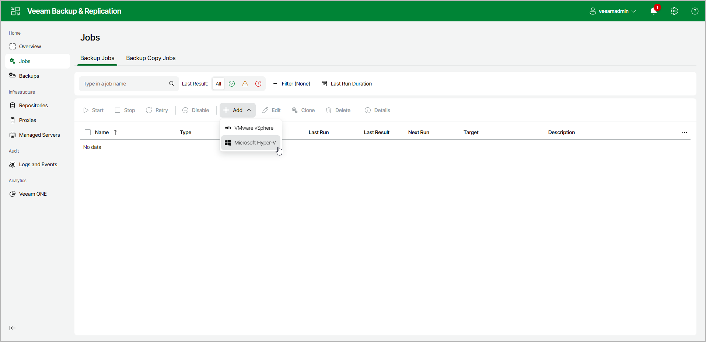

# Step 1. Launch New Backup Job Wizard

To launch the New Backup Job wizard, do the following:

1. In the management pane, click the Jobs node.
2. Click New Job on the ribbon and select Microsoft Hyper-V.

Page updated 2026-06-29

