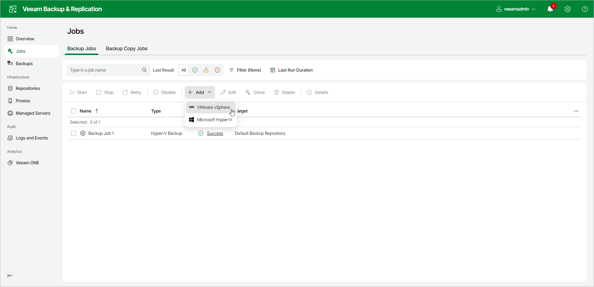

# Step 1. Launch New Backup Job Wizard

In this article

To launch the New Backup Job wizard, do the following:

1. In the management pane, click the Jobs node.
2. Click Add on the ribbon and select VMware vSphere.

Page updated 9/26/2025

Page content applies to build 13.0.1.1071
