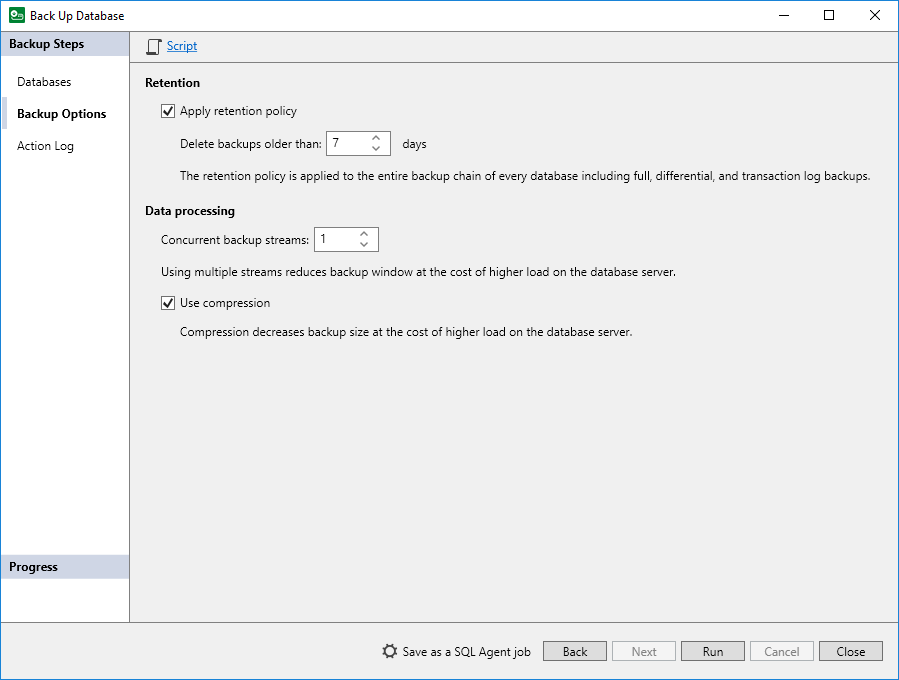

# Step 3. Specify Backup Options

At the Backup Options step of the wizard, specify data retention settings and data processing settings according to which you want to perform backup, and start the backup process:

1. [Optional] To specify data retention settings, in the Retention section, do the following:

1. Select the Apply retention policy check box.
2. In the Delete backups older than <N> days field, specify the number of days for which you want to keep backups in the backup repository. By default, Veeam Plug-In keeps backup files for 7 days.

1. [Optional] To specify settings for data processing during the backup process, in the Database processing section, do the following:

1. In the Concurrent backup streams field, specify the number of data streams over which you want to back up Microsoft SQL Server data. For each data stream, a separate VDI Device is started on the Microsoft SQL Server machine. For details about the logic behind concurrent backup streams and limitations, see [Data Streams and Resource Consumption](veeam_environment_planning_mssql.md#chann).
2. If you want to apply Veeam Backup & Replication mechanisms of data compression to the backup, select the Use compression check box. To Veeam Plug-In for Microsoft SQL Server backups, the Optimal (ZSTD) compression level is applied.

|  |
| --- |
| Note |
| Veeam Backup & Replication does not support data compression for databases encrypted with transparent data encryption (TDE). |

1. Click Run to start the backup process.

You can start the backup process if you want to create a backup immediately or if you want to check that backup process with the specified settings performs successfully.

If you want Veeam Plug-In to perform backup with the specified settings regularly, you can also perform one of the following operations:

* If you want to save backup settings as an SQL Agent job to be able to specify schedule for the backup job in Microsoft SQL Server Management Studio, click Save as a SQL Agent Job. For details, see [Saving Backup Settings as SQL Agent Job](mssql_backup_script.md).
* If you want to export backup settings to a custom script and use this script with a third-party scheduling tool, click Script. For details, see [Exporting Backup Settings to Custom Script](mssql_backup_agent_job.md).

If you do not want to start the backup process immediately, click Close to exit the wizard.

