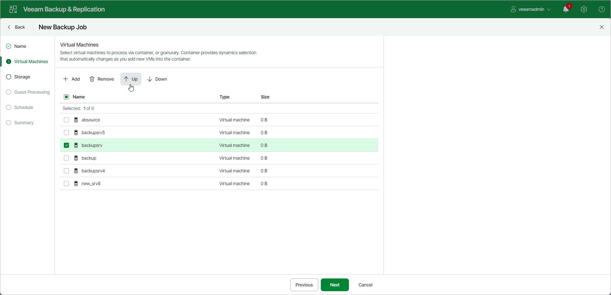

# Step 4. Define VM Backup Order

You can define the order in which the backup job must process VMs. Setting VM order can be helpful, for example, if you add some mission-critical VMs to the job and want the job to process them first. You can set these VMs first in the list to ensure their processing fits the backup window.

VMs inside a VM container are processed at random. To ensure that VMs are processed in the defined order, you must add them as standalone VMs, not as a part of the VM container.

To define the VM backup order:

1. At the Virtual Machines step of the wizard, select a VM or VM container.
2. Use the Up and Down buttons to move the VM or VM container up or down in the list.

|  |
| --- |
| Note |
| VMs may be processed in a different order. For example, if backup infrastructure resources for a VM that is higher on the priority list are not available, and resources for a VM that is lower on the list are available, Veeam Backup & Replication will start processing the VM that is lower on the list first. |

