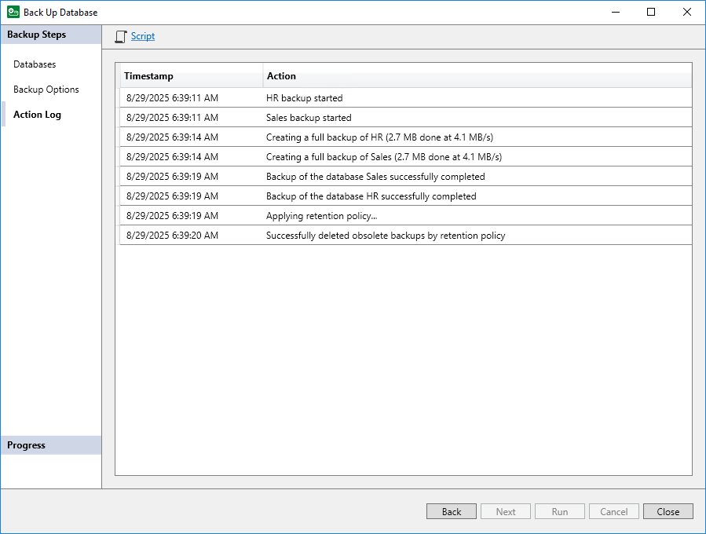

# Step 4. Monitor Backup Process

In this article

If you started the backup process at the Backup Options step of the wizard, at the Action Log step of the wizard review the list of backup operations and click Close to exit the wizard.

|  |
| --- |
| TIP |
| At this step of the wizard, you can also save backup settings as an SQL Agent job. You will be able to specify schedule for the backup job in Microsoft SQL Server Management Studio. For details, see [Saving Backup Settings as SQL Agent Job](mssql_backup_script.md). |

Page updated 11/6/2025

Page content applies to build 13.0.1.1071
