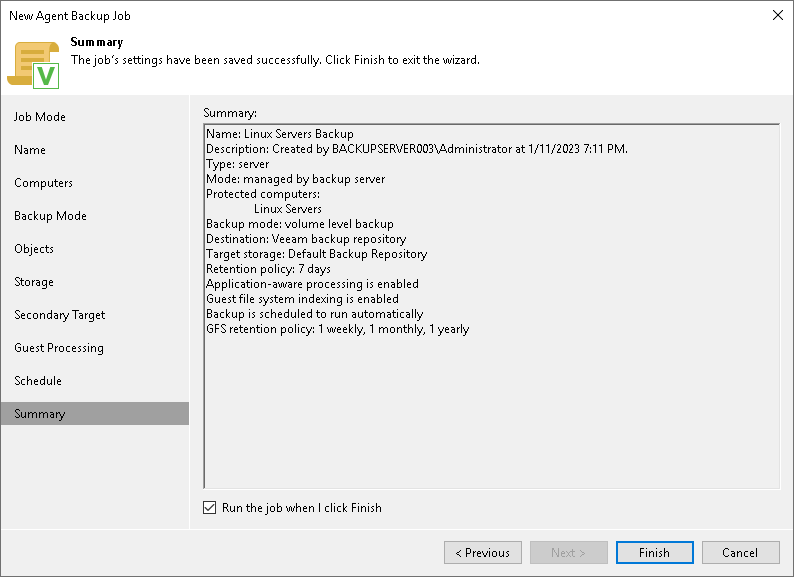

# Step 12. Review Backup Job Settings

In this article

At the Summary step of the wizard, complete the Veeam Agent backup job configuration process.

1. Review settings of the configured backup job.
2. Select the Run the job when I click Finish check box if you want to start the job right after you finish working with the wizard.
3. Click Finish to close the wizard.

Page updated 7/29/2025

Page content applies to build 13.0.1.1071
