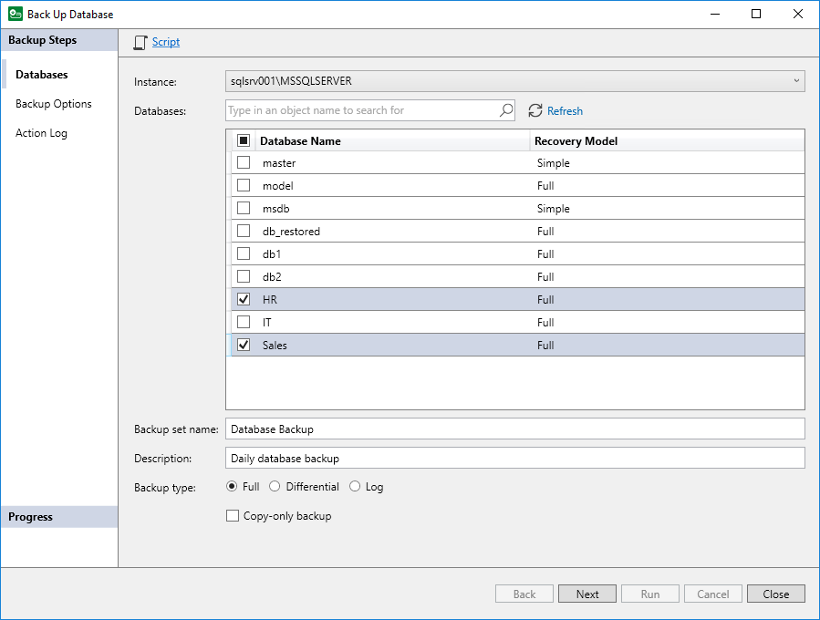

# Step 2. Select Databases to Back Up

In this article

At the Databases step of the wizard, select Microsoft SQL Server databases that you want to back up:

1. From the Instance drop-down list, select the SQL instance whose databases you want to back up.
2. In the Databases section, select check boxes next to the necessary databases. Alternatively, if you want to back up all databases of the selected instance, select the check box next to the Database Name column name.

To quickly find the necessary databases, you can type the name of the database in the search field and click the search icon.

To refresh the list of databases, click Refresh. When you refresh the list of databases, Veeam Plug-In will clear check boxes next to the selected databases.

1. In the Backup set name field, specify the name for the backup set. This will help you identify databases in case you need to restore a database from the backup.
2. In the Description field, specify description for the backup set. The name and description of the backup set will be displayed in the Restore Database wizard during restore.
3. In the Backup type section, select the type of backup you want to create. You can select from the following native Microsoft SQL Server backup types:

* Full — select this option if you want to create a backup that will contain a full copy of the SQL database.
* Differential — select this option if you want to create a backup that will contain changes since the previous backup was created.
* Log — select this option if you want to create a backup of Microsoft SQL Server transaction logs.

1. If you selected the Full or Log option and want to create a copy-only full backup or copy-only log backup, select the Copy-only backup check box. For example, you may want to create copy-only log backups if you use a separate solution to process Microsoft SQL Server transaction logs.

Keep in mind that differential backups cannot use the copy-only full backup as a starting point. To learn more, see [this Microsoft article](https://learn.microsoft.com/en-us/sql/relational-databases/backup-restore/copy-only-backups-sql-server?view=sql-server-ver16).

|  |
| --- |
| TIP |
| At this step of the wizard, you can also export backup settings to a custom script. You will be able to use this script with a third-party scheduling tool. For details, see [Exporting Backup Settings to Custom Script](mssql_backup_agent_job.md). |

Page updated 11/28/2025

Page content applies to build 13.0.1.1071
