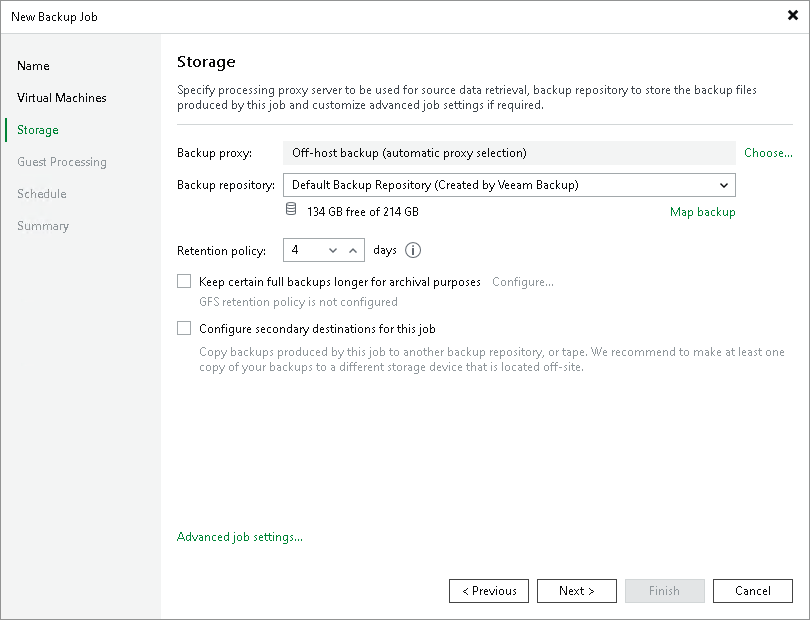

# Step 6. Specify Backup Storage Settings

In this article

At the Storage step of the wizard, select backup infrastructure components for the job — backup proxy and backup repository, and define backup storage settings.

1. Click Choose next to the Backup proxy field to select a backup proxy.

+ If you choose the On-host backup mode, the source Microsoft Hyper‑V host will perform the source host and backup proxy roles. In this mode, Veeam Data Mover runs directly on the source host, which helps streamline data retrieval operations but puts an additional load on the host.

If the job processes a VM whose disks are located on the CSV and the Microsoft CSV Software Shadow Copy Provider is used for snapshot creation, the Microsoft Hyper-V host owning the CSV will be used as the on-host backup proxy.

+ If you choose the Off-host backup mode, Veeam Data Mover will be started on a dedicated off-host backup proxy. In this mode, all backup processing operations are shifted to the off-host backup proxy from the source host.

By default, if the off-host backup mode is selected for the job but no off-host backup proxies are available when the job starts, Veeam Backup & Replication will automatically fail over to the on-host backup mode. To disable failover, clear the Failover to on-host backup mode if no suitable off-host proxies available check box. If you disable this option, you must check off-host backup proxies before the job starts. The job will not be able to start if off-host backup proxies are not available or are not configured correctly.

To perform off-host backup, Veeam Backup & Replication analyzes the current load on off-host backup proxies and proxy settings (such as the number of allowed tasks and connectivity to the source volumes) to select an appropriate off-host backup proxy for the job. You can also explicitly point out what off-host backup proxies the job must use. To do this, select the Use the following backup proxy servers only check box and choose one or several off-host backup proxies from the list. It is recommended that you select at least two off-host backup proxies to ensure that the backup job starts if one of the backup proxies fails or loses its connectivity to the source volumes.

1. From the Backup repository list, select a backup repository where the created backup files must be stored. When you select a backup repository, Veeam Backup & Replication automatically checks how much free space is available in the backup repository.

|  |
| --- |
| Note |
| Consider the following:   * If you change the repository after the job has already run, Veeam Backup & Replication suggests you move the existing backups to the new repository. If you want to move the backups, check the limitations and considerations in [Backup Move](backup_moving_hv.md). * If you select an object storage repository or a scale-out backup repository which performance tier consists of object storage repositories, Veeam Backup & Replication will not provide the amount of free space in this repository since its capacity is constantly expanding. |

1. You can map the job to a specific backup stored in the backup repository. Backup job mapping can be helpful if you have moved backup files to a new backup repository and want to point the job to existing backups in this new backup repository. You can also use backup job mapping if the configuration database gets corrupted and you need to reconfigure backup jobs.

To map the job to a backup, click the Map backup link and select the backup in the backup repository. Backups can be easily identified by job names. To find the backup, you can also use the search field at the bottom of the window.

|  |
| --- |
| Note |
| If you map a backup chain with GFS full backups to a backup job that has GFS retention disabled, the mapped GFS full backups will be deleted when the retention policy runs. To retain GFS backups, enable the same GFS retention settings in the target job before mapping. |

1. In the Retention Policy field, specify retention policy settings for restore points.

To keep all restore points created during the last N days, specify the number of days. When the specified number is exceeded, the earliest restore point is removed from the backup chain or merged with the next closest restore point. For more information, see [Short-Term Retention Policy](retention_policy.md).

|  |
| --- |
| Important |
| Consider the following:   * If you enable the [GFS retention](gfs_retention_policy.md), the short-term retention policy will not be able to delete and merge the GFS backup files. Thus, the backup chain will have more restore points than specified in the short-term retention policy. * For backup jobs created in Veeam Backup & Replication versions prior to 13, you could specify the number of restore points for the retention policy. In version 13, this option is deprecated, and you cannot select it in new jobs. However, backup jobs created in Veeam Backup & Replication prior to version 13 that use retention based on restore points will continue to work after upgrading to Veeam Backup & Replication version 13. For more information on the retention policy, see the [Specify Backup Storage Settings](https://helpcenter.veeam.com/docs/backup/vsphere/backup_job_storage_vm.html?ver=120) section in Veeam Backup & Replication User Guide for version 12. |

1. If you want to archive backup files created by the backup job to a secondary destination (backup repository or tape), select the Configure secondary destinations for this job check box. With this option enabled, the New Backup Job wizard will include an additional step — Secondary Target. At the Secondary Target step of the wizard, you can link the backup job to the backup copy job or backup to tape backup job.

You can enable this option only if a backup copy job or backup to tape job is already configured on the backup server.

Related Topics

[Targeting Jobs to Another Repository](jobs_target_hv.md)

Page updated 9/17/2025

Page content applies to build 13.0.1.1071
