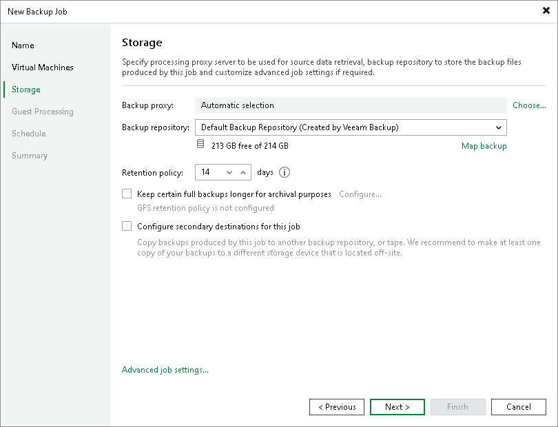

# Step 6. Specify Backup Storage Settings

At the Storage step of the wizard, select backup infrastructure components for the job — backup proxy and backup repository, and specify backup storage settings.

1. Click Choose next to the Backup proxy field to select a backup proxy.

+ If you choose Automatic selection, Veeam Backup & Replication will detect backup proxies with access to the source datastore and automatically assign an optimal backup proxy to process VMs in the job.

Veeam Backup & Replication assigns backup proxies to VMs included in the backup job one by one. Before processing a new VM in the VM list, Veeam Backup & Replication checks available backup proxies. If more than one backup proxy is available, Veeam Backup & Replication analyzes transport modes that the backup proxies can use to retrieve VM data and the current workload on the backup proxies to select the most appropriate one for VM processing.

+ If you choose Use the selected backup proxy servers only, you can explicitly select backup proxies that the job must use. It is recommended that you select at least two backup proxies to ensure that the backup job starts if one of the proxies fails or loses connectivity to the source datastore.

If you plan to use the Backup from Storage Snapshots technology, see section [Requirements and Limitations for Backup Proxies (Storage Systems)](storage_configure_proxy.md).

1. From the Backup repository list, select a backup repository where the created backup files must be stored. When you select a backup repository, Veeam Backup & Replication automatically checks how much free space is available in the backup repository.

|  |
| --- |
| Note |
| Consider the following:   * If you change the repository after the job has already run, Veeam Backup & Replication suggests that you move the existing backups to the new repository. If you want to move the backups, see limitations and considerations in [Backup Move](backup_moving.md). * If you select an object storage repository or a scale-out backup repository which performance tier consists of object storage repositories, Veeam Backup & Replication will not provide the amount of free space in this repository since its capacity is constantly expanding. |

1. You can map the job to a specific backup stored in the backup repository. Backup job mapping can be helpful if you have moved backup files to a new backup repository and want to point the job to existing backups in this new backup repository. You can also use backup job mapping if the configuration database gets corrupted and you need to reconfigure backup jobs.

To map the job to a backup, click the Map backup link and select the backup in the backup repository. Backups can be easily identified by job names. To find the backup, you can also use the search field at the bottom of the window.

|  |
| --- |
| Note |
| If you map a backup chain with GFS full backups to a backup job that has GFS retention disabled, the mapped GFS full backups will be deleted when the retention policy runs. To retain GFS backups, enable the same GFS retention settings in the target job before mapping. |

1. In the Retention Policy field, specify retention policy settings for restore points.

To keep all restore points created during the last N days, specify the number of days. When the specified number is exceeded, the earliest restore point is removed from the backup chain or merged with the next closest restore point. For more information, see [Short-Term Retention Policy](retention_policy.md).

|  |
| --- |
| Important |
| Consider the following:   * If you enable the [GFS retention](gfs_retention_policy.md), the short-term retention policy will not be able to delete and merge the GFS backup files. Thus, the backup chain will have more restore points than specified in the short-term retention policy. * For backup jobs created in Veeam Backup & Replication versions prior to 13, you could specify the number of restore points for the retention policy. In version 13, this option is deprecated, and you cannot select it in new jobs. However, backup jobs created in Veeam Backup & Replication prior to version 13 that use retention based on restore points will continue to work after upgrading to Veeam Backup & Replication version 13. For more information on the retention policy, see the [Specify Backup Storage Settings](https://helpcenter.veeam.com/docs/backup/vsphere/backup_job_storage_vm.html?ver=120) section in Veeam Backup & Replication User Guide for version 12. |

1. If you want to archive backup files created by the backup job to a secondary destination, select the Configure secondary destinations for this job check box. The New Backup Job wizard will include the Secondary Target step, where you will link the job to the required destination. You can use the following destinations:

* Backup repository (by linking to a backup copy job)
* Tape (by linking to a tape backup job)
* Storage array (by linking to a storage array feature)

You can enable this option only if a secondary destination job or feature is already configured. For more information, see [Specify Secondary Target](vmware_backup_secondary_target.md).

Related Topics

[Targeting Jobs to Another Repository](jobs_target.md)

