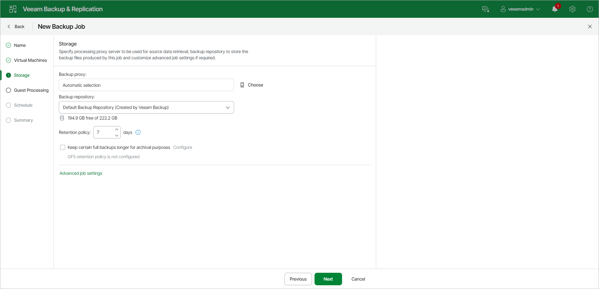

# Step 5. Specify Backup Storage Settings

In this article

At the Storage step of the wizard, select backup infrastructure components for the job — backup proxy and backup repository, and specify backup storage settings:

1. Click Choose next to the Backup proxy field to select a backup proxy.

+ If you choose Automatic selection, Veeam Backup & Replication will detect backup proxies with access to the source datastore and automatically assign an optimal backup proxy to process VMs in the job.

Veeam Backup & Replication assigns backup proxies to VMs included in the backup job one by one. Before processing a new VM in the VM list, Veeam Backup & Replication checks available backup proxies. If more than one backup proxy is available, Veeam Backup & Replication analyzes transport modes that the backup proxies can use to retrieve VM data and the current workload on the backup proxies to select the most appropriate one for VM processing.

+ If you choose Use the selected backup proxy servers only, you can explicitly select backup proxies that the job must use. It is recommended that you select at least two backup proxies to ensure that the backup job starts if one of the proxies fails or loses connectivity to the source datastore.

If you plan to use the Backup from Storage Snapshots technology, see section [Requirements and Limitations for Backup Proxies (Storage Systems)](storage_configure_proxy.md).

1. From the Backup repository list, select a backup repository where the created backup files must be stored. When you select a backup repository, Veeam Backup & Replication automatically checks how much free space is available in the backup repository.

|  |
| --- |
| Note |
| Consider the following:   * If you change the repository after the job has already run, Veeam Backup & Replication suggests that you move the existing backups to the new repository. If you want to move the backups, see limitations and considerations in [Backup Move](backup_moving.md). * If you select an object storage repository or a scale-out backup repository which performance tier consists of object storage repositories, Veeam Backup & Replication will not provide the amount of free space in this repository since its capacity is constantly expanding. |

1. In the Retention Policy field, specify retention policy settings for restore points.

To keep all restore points created during the last N days, specify the number of days. When the specified number is exceeded, the earliest restore point is removed from the backup chain or merged with the next closest restore point. For more information, see [Short-Term Retention Policy](retention_policy.md).

|  |
| --- |
| Note |
| If you enable the [GFS retention](gfs_retention_policy.md), the short-term retention policy will not be able to delete and merge the GFS backup files. Thus, the backup chain will have more restore points than specified in the short-term retention policy. |

Page updated 9/18/2025

Page content applies to build 13.0.1.1071
