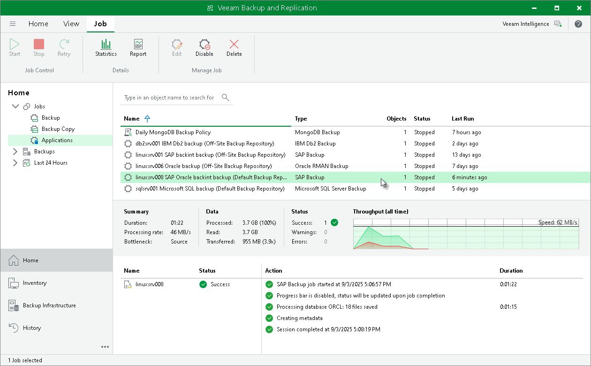
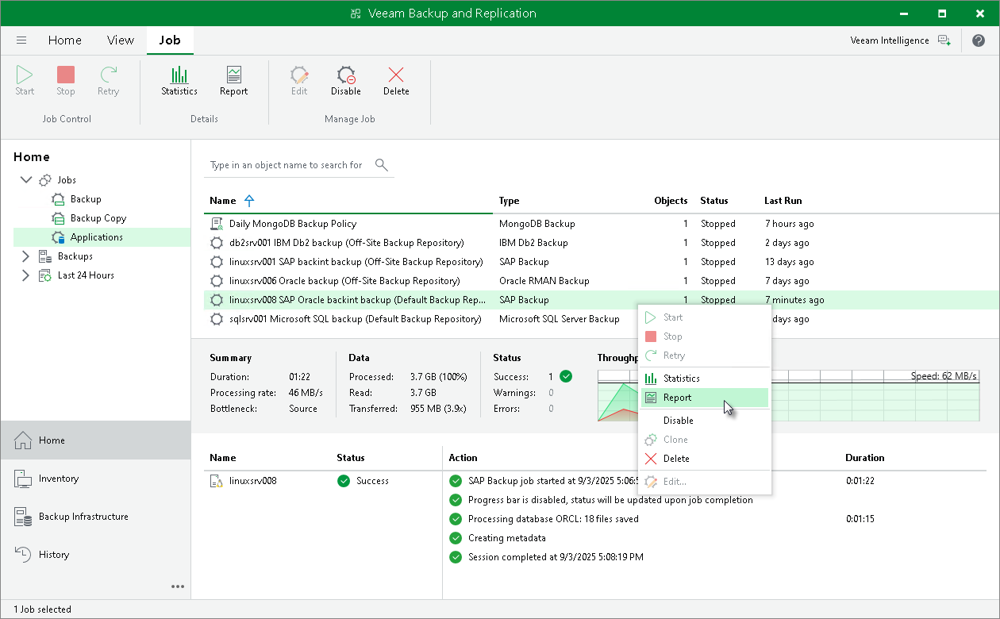
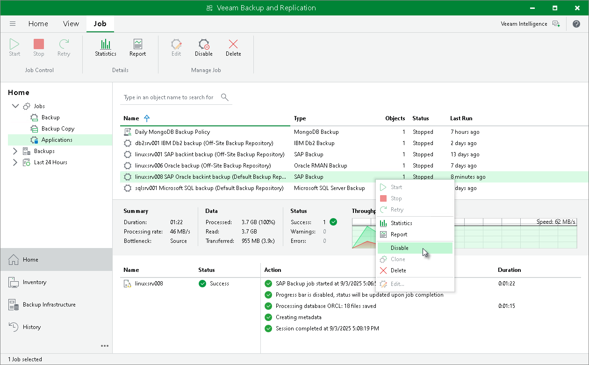

# Backup Job in Veeam Backup & Replication

In this article

|  |
| --- |
| Tip |
| If you want to configure or manage an application backup policy for Veeam Plug-In operating in the managed mode, see [Working with Application Policies](application_policies.md). |

After you start a backup process with the BRBACKUP tool, Veeam Backup & Replication creates a backup job object. You can use this job to view the statistics on the backup process, generate backup job reports or you can also disable the backup job.

You cannot launch or edit SAP on Oracle backup job objects in the Veeam Backup & Replication console. You can manage backup operations only on the SAP on Oracle side using BR\*Tools.

Consider that Veeam Backup & Replication generates the backup job name based on names of the SAP on Oracle server and selected repository.

|  |
| --- |
| Note |
| Due to specifics of the SAP on Oracle backup process, the progress bar of a running SAP on Oracle backup job is not available. |

To view details of a backup job process, do the following:

1. Open the Veeam Backup & Replication console.
2. In the Home view, expand the Jobs node and click Backup.
3. In the list of jobs, select the BR\*Tools backup job to see details of the current backup process or the last backup job session.

Generating Backup Job Reports

Veeam Backup & Replication can generate reports with details about an BR\*Tools backup job session performance. The session report contains the following session statistics: session duration details, details of the session performance, amount of read, processed and transferred data, backup size, compression ratio, list of warnings and errors (if any).

1. Open the Home view.
2. In the inventory pane, select Jobs.
3. In the working area, select the necessary job and click Report on the ribbon. You can also right-click the job and select Report.

Disabling Backup Job

You can disable BR\*Tools backup jobs in the Veeam Backup & Replication console. If you disable the job, you will not be able to run BR\*Tools backup commands on the SAP on Oracle server.

To disable a backup job:

1. Open the Home view.

1. In the inventory pane, select Jobs.

1. In the working area, select the necessary job and click Disable on the ribbon. You can also right-click the job and select Disable.

Page updated 9/3/2025

Page content applies to build 13.0.1.1071
