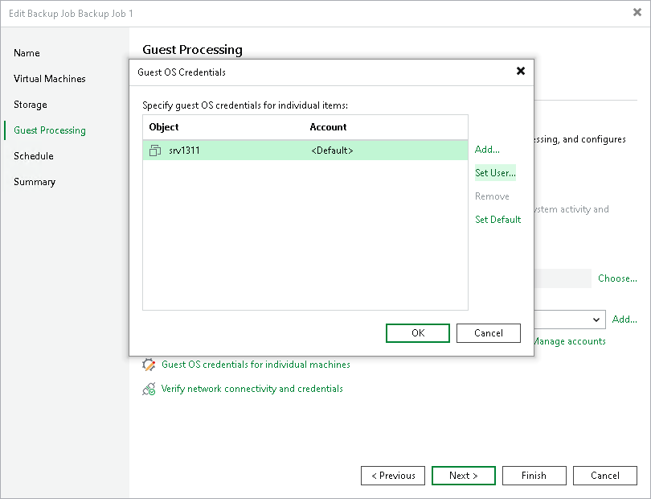

# Manage Guest OS Credentials

In this article

If you enable application-aware processing or instruct Veeam Backup & Replication to create a catalog of VM files and folders, you must also specify a user whose credentials are used to communicate with VM guest OSes. Note that the specified user must have the permissions required to perform guest processing. For more information on the required permissions, see [Performing Guest Processing](required_permissions.md#rptcb).

If you have installed persistent agent components for VMs running Linux operating systems, you can select Use management agent credentials from the list. For more information, see [Installing Persistent Agent Components on Linux VMs](persistent_agent_components.md#persistent_components_for_linux).

|  |
| --- |
| Note |
| Management Agent credentials have root or elevated to root permissions. If you do not want to perform guest processing tasks under the account with such privileges, you can specify a non-root user account. This account or custom credentials added for specific VMs will also be used for SSH connection or networkless guest processing over VIX API/vSphere Web Services if the transport service connection fails. |

By default, Veeam Backup & Replication uses a single set of credentials to access guest OSes of all VMs included in the backup scope. However, since Windows-based VMs and Linux-based VMs require different types of access credentials, you may need to specify the credentials explicitly for each processed VM. To do that:

1. Click Guest OS credentials for individual machines.
2. In the Guest OS Credentials window, select a VM.
3. Click Set User and choose Standard credentials for a Windows-based VM or SSH credentials for a Linux-based VM.

To display a user in the Credentials list, you must add the user to the Credentials Manager as described in section [Credentials Manager](credentials_manager.md). If you have not added the necessary user to the Credentials Manager beforehand, you can do it without closing the New Job wizard. To do that, click either the Manage accounts link or the Add button, and specify the user name, password and description in the Credentials window.

By default, Veeam Backup & Replication uses the Log on as a batch job policy to connect to guest OS. If the connection fails, Veeam Backup & Replication switches to Interactive Logon.

|  |
| --- |
| Note |
| If you use Kerberos authentication, consider the requirements and limitations described in section [Kerberos Authentication](kerberos_authentication.md). |

To check whether Veeam Backup & Replication can connect to the VM guest OSes using the specified credentials, click Verify network connectivity and credentials. Veeam Backup & Replication will use the specified credentials to connect to all VMs in the list.

Page updated 12/9/2025

Page content applies to build 13.0.1.1071
