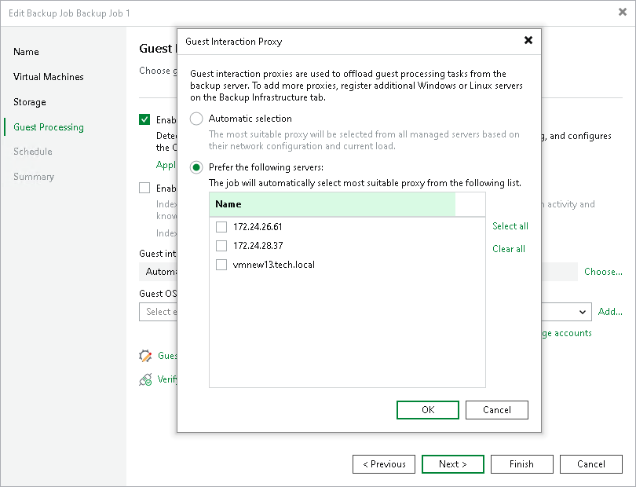

# Choose Guest Interaction Proxy

In this article

To produce transactionally consistent backups and to perform file system indexing, Veeam Backup & Replication communicates with the guest OS of each processed VM to deploy non-persistent runtime components that coordinate guest processing activities such as accessing VM applications and creating a catalog of VM files. Since these activities may significantly increase the load on the backup server in case of a large backup scope, Veeam Backup & Replication distributes the load among all Microsoft Windows and Linux servers added to the backup infrastructure (further referred to as guest interaction proxies).

By default, Veeam Backup & Replication automatically chooses which guest interaction proxy to use for each of the processed VMs based on network settings and rules listed in the Veeam Backup & Replication User Guide, section [Guest Interaction Proxies](guest_interaction_proxy.md).

To connect a backup server to the processed VM guest OS, specify the [guest interaction proxy](guest_interaction_proxy.md). On the right of the Guest interaction proxy field, click Choose and select one of the following:

* Leave Automatic selection to let Veeam Backup & Replication automatically select the guest interaction proxy.

* Select Prefer the following servers to explicitly define which servers will perform the guest interaction proxy role. The list of servers contains Microsoft Windows and Linux servers added to the backup infrastructure.

|  |
| --- |
| Note |
| The guest interaction proxy functionality is included in the Veeam Universal License. If you use the legacy socket-based license, you will require an Enterprise or higher edition. |

For a server to be displayed in the list of available log shipping servers, it must be added to the backup infrastructure as described in sections [Adding Microsoft Windows Servers](add_windows_server.md) and [Adding Linux Servers](add_linux_server.md).

|  |
| --- |
| Important |
| Due to technical limitations, Linux-based proxies cannot access Windows guest OSes in the current version. That is why if you have added Windows-based VMs to back up at step 3 of the wizard, you must also add at least one Microsoft Windows-based server to the backup infrastructure. |

Page updated 12/8/2025

Page content applies to build 13.0.1.1071
