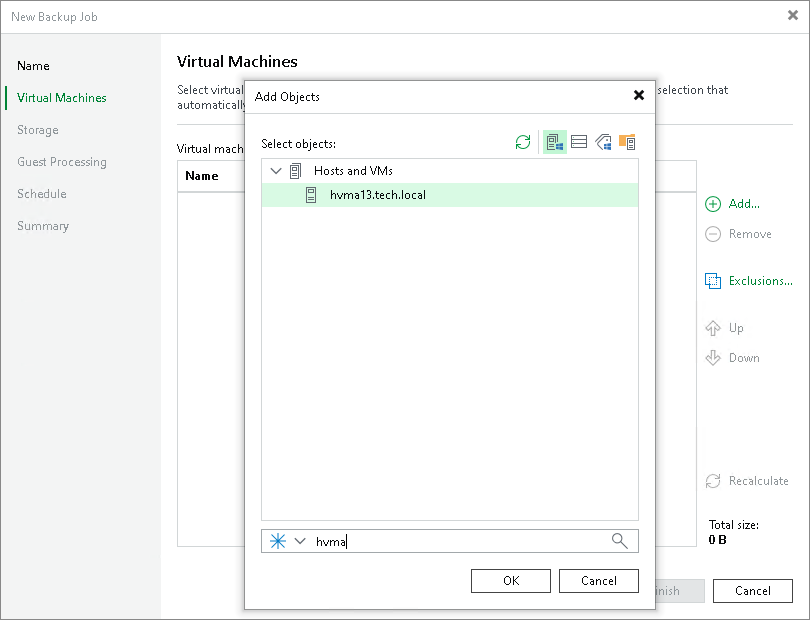

# Step 3. Select VMs to Back Up

At the Virtual Machines step of the wizard, select VMs and VM containers (Hyper-V hosts, clusters, SCVMM, SCVMM tags, SCVMM host groups, VM groups, or volumes) that you want to back up.

Jobs with VM containers are dynamic. If a new VM is added to the container in the virtual infrastructure after the backup job is created, Veeam Backup & Replication will automatically update the job settings to include the added VM.

1. Click Add.
2. Use the toolbar at the top right corner of the window to switch between views: Hosts and Clusters, Hosts and Volumes, VMs and Tags, VM Groups.
3. Select the VM or VM container in the list and click OK.

To quickly find the necessary object, you can use the search field at the bottom of the Add Objects window.

1. Click the button to the left of the search field and select the necessary type of object to search for Everything, Folder, Host Group, SCVMM, Cluster, Host, or VM.
2. Enter the object name or a part of it in the search field.
3. Click the Start search button on the right or press [Enter] on the keyboard.

The initial size of VMs and VM containers added to the backup job is displayed in the Size column in the list. The total size of objects is displayed in the Total size field. Use the Recalculate button to refresh the total size value after you add a new object to the job.

