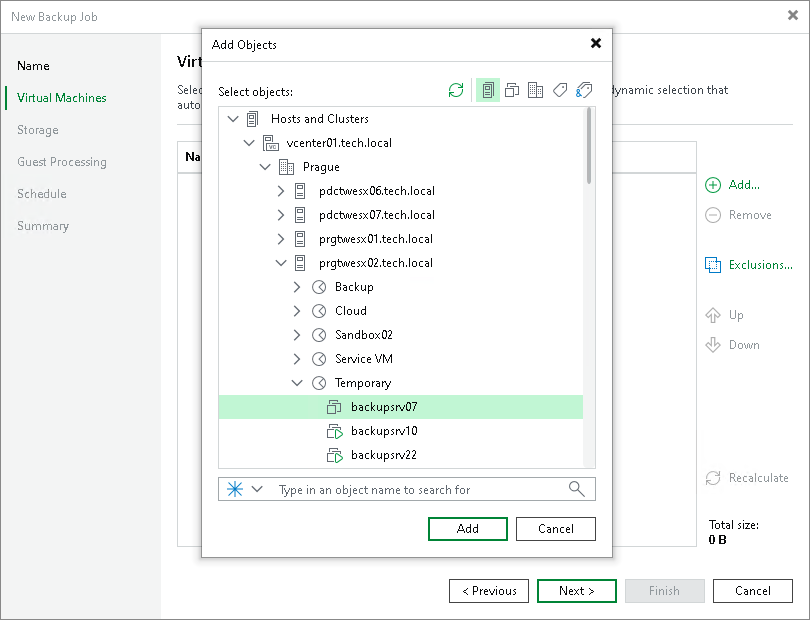

# Step 3. Select VMs to Back Up

In this article

At the Virtual Machines step of the wizard, select VMs and VM containers (hosts, clusters, folders, resource pools, VirtualApps, datastores or tags) that you want to back up:

1. Click Add.
2. In the Add Objects window, select the necessary VMs or VM containers and click Add. If you select VM containers and add new VMs to this container in the future, Veeam Backup & Replication will update backup job settings automatically to include these VMs.

You can use the toolbar at the top right corner of the window to switch between views. Depending on the view you select, some objects may not be available. For example, if you select the Tags combination view, no resource pools, hosts or clusters will be displayed in the tree. In the Tags combination view, you can select multiple tags, and only those VMs that have all the selected tags will be processed by the job.

To quickly find the necessary VMs, you can use the search field at the bottom of the Add Object window. If you want to switch between the types of VMs you want to search through, use the button to the left of the search field.

|  |
| --- |
| Note |
| You can use a regular backup job to process VMs that are part of vApps created in the vCenter Server. To back up VMware Cloud Director vApps, you must use specifically developed VMware Cloud Director backup jobs. For more information, see [Backup for VMware Cloud Director](vcloud_director_backup.md). |

The total size of objects added to the job is displayed in the Total size field. Use the Recalculate button to refresh the total size value after you add a new object to the job.

Page updated 8/14/2025

Page content applies to build 13.0.1.1071
