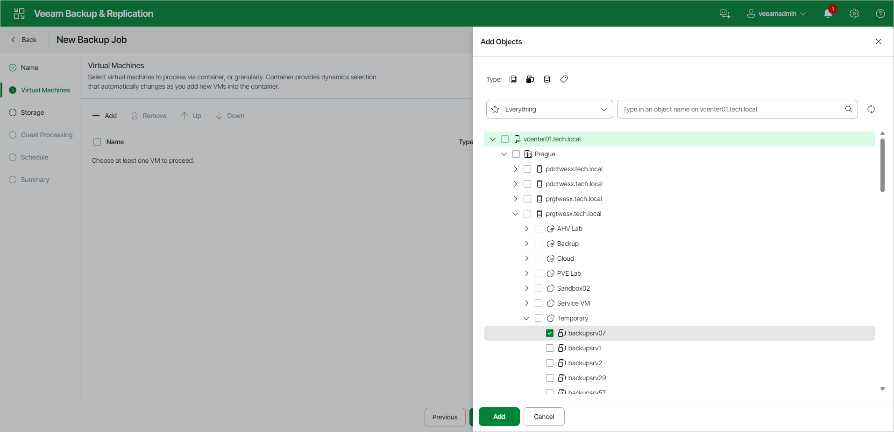

# Step 3. Select VMs to Back Up

At the Virtual Machines step of the wizard, select VMs and VM containers (hosts, clusters, folders, resource pools, vApps, datastores or tags) that you want to back up:

1. Click Add.
2. In the Add Objects window, select the necessary VMs or VM containers and click Add. If you select VM containers and add new VMs to this container in the future, Veeam Backup & Replication will update backup job settings automatically to include these VMs.

You can use the toolbar at the top of the window to switch between views. Depending on the view you select, some objects may not be available.

To quickly find the necessary VMs, you can use the search field below the toolbar. If you want to switch between the types of VMs you want to search through, use the drop-down list to the left of the search field.

You do not have to add any objects at this step. If you leave the list empty, Veeam Backup & Replication creates an empty backup job. You can edit the job later to add VMs and VM containers.

|  |
| --- |
| Important |
| An empty backup job may fail if it runs on schedule, especially if guest processing is enabled. To avoid this, add at least one VM or VM container to the job before its scheduled run. |

Page updated 2026-07-15

