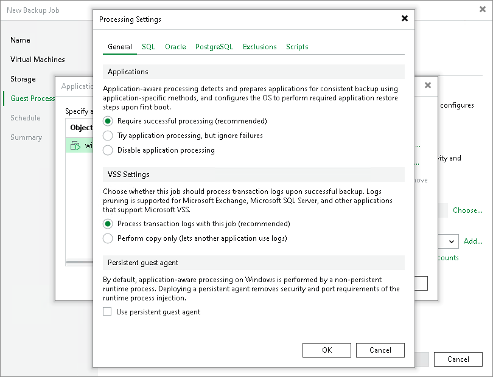

# Enable Application-Aware Processing

In this article

To create transactionally consistent backups of VMs, you must enable application-aware processing. Application-aware processing allows you to define the method to process applications and application logs and select if you want to use the persistent agent.

Enabling Application-Aware Processing

Before configuring general application-aware processing settings, check that application-aware processing is enabled:

1. At the Guest Processing step of the wizard, select the Enable application-aware processing check box.
2. Click Application handling options for individual machines.
3. In the Application-Aware Processing Options window, select the VM and click Edit.

To define custom settings for a VM added as a part of a VM container, you must include the VM to the list as a standalone object. To do this, click Add and choose the VM whose settings you want to customize. Then, select the VM in the list and define the necessary settings.

Defining General Application-Aware Processing Settings

1. To specify the behavior scenario for application-aware processing, on the General tab in the Applications section, do one of the following:

* If you want Veeam Backup & Replication to stop the backup process when an error occurs during application-aware processing, select Require successful processing.

* If you want to continue the backup process when an error occurs during application-aware processing, select Try application processing, but ignore failures. This option guarantees the completion of the backup job. In this case, Veeam Backup & Replication will create a crash-consistent backup instead of a transactionally consistent backup.

|  |
| --- |
| Important |
| If application-aware processing fails, the backup job will not process SQL transaction logs until Veeam Backup & Replication creates a new image-level backup of the Microsoft SQL Server VM. |

* If you do not want to enable application-aware processing for the VM, select Disable application processing.

1. If you want Veeam Backup & Replication to process application logs or create copy-only backups, in the VSS Settings section, do one of the following:

* [For Microsoft Exchange and Microsoft SQL VMs] If you want Veeam Backup & Replication to process application logs, select Process transaction logs with this job and specify settings on the SQL tab. For more information, see [Microsoft SQL Server Transaction Log Settings](backup_job_vss_sql_vm.md).

|  |
| --- |
| Note |
| [For Microsoft Exchange VMs] If you select this option, Veeam Backup & Replication will back up the Exchange database and its logs. The non-persistent runtime components or persistent components that run on the VM guest OS will wait for a backup job to complete successfully. After that, they will trigger truncation of transaction logs on a Microsoft Exchange server. If the backup job fails, the logs on this server will remain untouched. |

* [For Microsoft Exchange and Microsoft SQL VMs] If you use a third-party backup tool to perform VM guest level backup, and this tool maintains consistency of the database state, select Perform copy only. Veeam Backup & Replication will create a copy-only backup for the selected VM. The copy-only backup preserves the chain of full or differential backup files and transaction logs on the VM. For more information, see [Microsoft Docs](http://msdn.microsoft.com/en-us/library/ms191495.aspx).

Note that if you select this option, the SQL tab will not be available in the Processing Settings window.

* [For Oracle VMs and PostgreSQL VMs] You must specify settings for application log handling on the Oracle and PostgreSQL tabs of the Processing Settings window. For more information, see [Oracle Archived Redo Log Settings](backup_job_vss_oracle_vm.md) and [PostgreSQL WAL Files Settings](backup_job_vss_postgresql_vm.md).

1. If you want Veeam Backup & Replication to use persistent guest agents on each protected VM for application-aware processing, select the Use persistent guest agent check box.

For more information, see [Persistent Agent Components](persistent_agent_components.md).

|  |
| --- |
| Important |
| If both Microsoft SQL Server and Oracle Server are installed on one VM, and this VM is processed by a job with log backup enabled for both applications, Veeam Backup & Replication will back up only Oracle transaction logs. Microsoft SQL Server transaction logs will not be processed. |

Page updated 12/9/2025

Page content applies to build 13.0.1.1071
