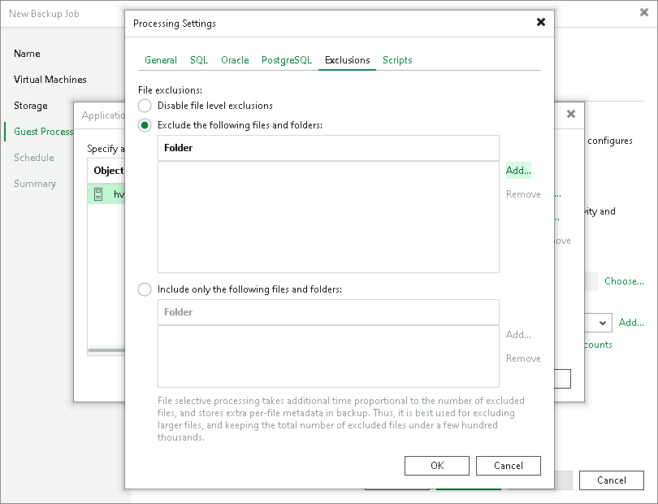

# VM Guest OS File Exclusion

If you do not want to back up specific files and folders on the VM guest OS, you can exclude them from the backup.

|  |
| --- |
| Note |
| The availability of the file exclusion feature depends on the license you use. For more details about licensing support, see [Veeam Data Platform Feature Comparison](https://www.veeam.com/veeam_data_platform_feature_comparison_ds.pdf). |

To specify excluded files and folders, do the following:

1. Click the Exclusions tab and specify what files must be excluded from the backup:

+ Select Exclude the following files and folders to remove the individual files and folders from the backup.
+ Select Include only the following files and folders to leave only the specified files and folders in the backup.

1. Click Add and specify what files and folders you want to include or exclude. To form the list of exclusions or inclusions, you can use full paths to files and folders, environmental variables and file masks with the asterisk (\*) and question mark (?) characters. For more information, see [VM Guest OS Files](guest_file_exclusion_hv.md).

|  |
| --- |
| Note |
| When you choose files to be included or excluded, consider the requirements and limitations that are listed in section [Requirements and Limitations for VM Guest OS File Exclusion](guest_file_exclusion_hv.md#reqs). |

1. Click OK.
2. Repeat steps 5-6 for every file or folder you want to exclude or include.

|  |
| --- |
| Note |
| Volumes on the dynamic disks must not be split. Spanned, striped and other types of split volumes cannot be excluded. |

